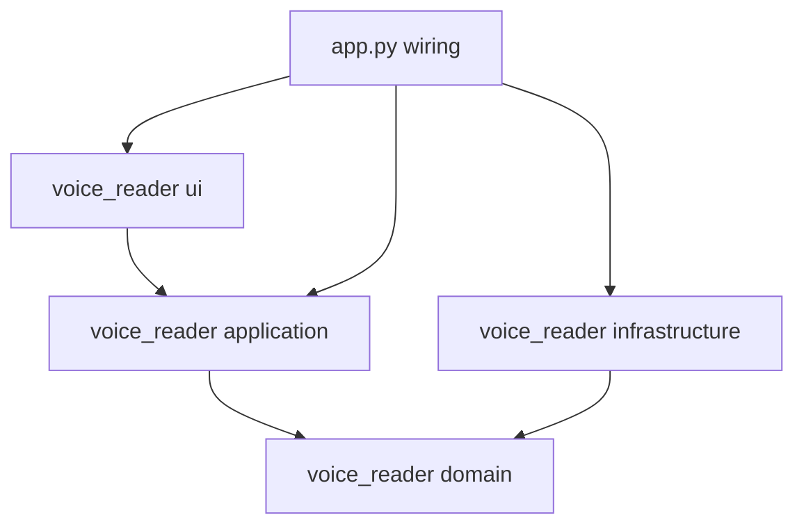
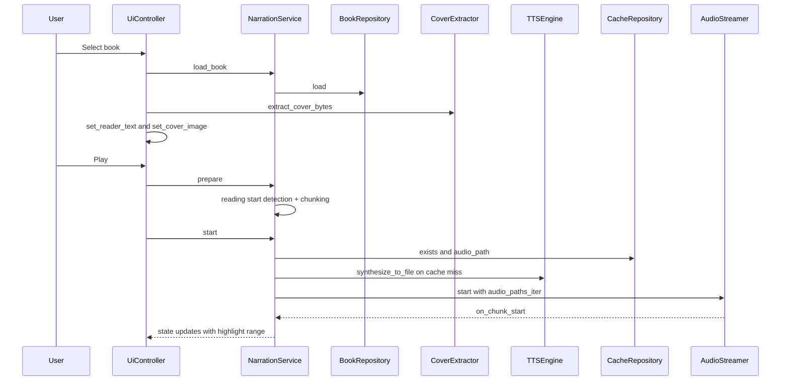

# Architecture

This document describes the current structure of the `voice_reader` codebase and how the application runs end-to-end.

## High-level overview

- Entry point + wiring happens in [`app.py`](app.py:1), specifically [`main()`](app.py:33).
- UI is a PySide6 desktop app: [`MainWindow`](voice_reader/ui/main_window.py:34) is the widget tree; [`UiController`](voice_reader/ui/ui_controller.py:21) bridges UI events to application services.
- The primary orchestration service is [`NarrationService`](voice_reader/application/services/narration_service.py:36).
- Domain logic lives under [`voice_reader/domain`](voice_reader/domain:1) and is expressed as:
  - pure services (chunking, reading-start detection, spoken-text sanitization)
  - protocols (interfaces) for IO-heavy concerns (TTS engines, audio playback, book loading, caching)
- Infrastructure adapters live under [`voice_reader/infrastructure`](voice_reader/infrastructure:1) and implement domain protocols.

## Module layout (by layer)

- UI layer: [`voice_reader/ui`](voice_reader/ui:1)
  - [`MainWindow`](voice_reader/ui/main_window.py:34): widgets, theming, highlighting, cover display
  - [`UiController`](voice_reader/ui/ui_controller.py:21): file picker, wiring signals, applying narration state to UI

- Application layer: [`voice_reader/application`](voice_reader/application:1)
  - DTOs: [`NarrationState`](voice_reader/application/dto/narration_state.py:20), [`NarrationStatus`](voice_reader/application/dto/narration_state.py:9)
  - Services:
    - [`NarrationService`](voice_reader/application/services/narration_service.py:36): core orchestration
    - [`TTSEngineFactory`](voice_reader/application/services/tts_engine_factory.py:19): picks the best available engine via [`TTSEngineFactory.create()`](voice_reader/application/services/tts_engine_factory.py:22)
    - [`VoiceProfileService`](voice_reader/application/services/voice_profile_service.py:15): lists voices via repo
    - [`DeviceDetectionService`](voice_reader/application/services/device_detection_service.py:6): returns cpu/cuda via [`DeviceDetectionService.detect()`](voice_reader/application/services/device_detection_service.py:7)

- Domain layer: [`voice_reader/domain`](voice_reader/domain:1)
  - Entities: [`Book`](voice_reader/domain/entities/book.py:1), [`TextChunk`](voice_reader/domain/entities/text_chunk.py:1), [`VoiceProfile`](voice_reader/domain/entities/voice_profile.py:1)
  - Protocols (interfaces):
    - [`BookRepository`](voice_reader/domain/interfaces/book_repository.py:1)
    - [`CacheRepository`](voice_reader/domain/interfaces/cache_repository.py:1)
    - [`TTSEngine`](voice_reader/domain/interfaces/tts_engine.py:11)
    - [`AudioStreamer`](voice_reader/domain/interfaces/audio_streamer.py:14)
    - [`VoiceProfileRepository`](voice_reader/domain/interfaces/voice_profile_repository.py:1)
  - Pure services:
    - [`ChunkingService`](voice_reader/domain/services/chunking_service.py:32) via [`ChunkingService.chunk_text()`](voice_reader/domain/services/chunking_service.py:37)
    - [`ReadingStartService`](voice_reader/domain/services/reading_start_service.py:23) via [`ReadingStartService.detect_start()`](voice_reader/domain/services/reading_start_service.py:29)
    - [`SpokenTextSanitizer`](voice_reader/domain/services/spoken_text_sanitizer.py:27) via [`SpokenTextSanitizer.sanitize()`](voice_reader/domain/services/spoken_text_sanitizer.py:28)

- Infrastructure layer: [`voice_reader/infrastructure`](voice_reader/infrastructure:1)
  - Books:
    - [`CalibreConverter`](voice_reader/infrastructure/books/converter.py:18) via [`CalibreConverter.convert_to_epub_if_needed()`](voice_reader/infrastructure/books/converter.py:22)
    - [`BookParser`](voice_reader/infrastructure/books/parser.py:20) via [`BookParser.parse()`](voice_reader/infrastructure/books/parser.py:21)
    - [`LocalBookRepository`](voice_reader/infrastructure/books/repository.py:16) via [`LocalBookRepository.load()`](voice_reader/infrastructure/books/repository.py:20)
    - [`CoverExtractor`](voice_reader/infrastructure/books/cover_extractor.py:25) via [`CoverExtractor.extract_cover_bytes()`](voice_reader/infrastructure/books/cover_extractor.py:26)
  - Cache:
    - [`FilesystemCacheRepository`](voice_reader/infrastructure/cache/filesystem_cache.py:12) via [`FilesystemCacheRepository.audio_path()`](voice_reader/infrastructure/cache/filesystem_cache.py:15)
  - TTS engines:
    - [`KokoroEngine`](voice_reader/infrastructure/tts/kokoro_engine.py:30) via [`KokoroEngine.synthesize_to_file()`](voice_reader/infrastructure/tts/kokoro_engine.py:71)
    - [`XTTSCoquiEngine`](voice_reader/infrastructure/tts/xtts_engine.py:21) via [`XTTSCoquiEngine.synthesize_to_file()`](voice_reader/infrastructure/tts/xtts_engine.py:42)
    - [`Pyttsx3Engine`](voice_reader/infrastructure/tts/pyttsx3_engine.py:19) via [`Pyttsx3Engine.synthesize_to_file()`](voice_reader/infrastructure/tts/pyttsx3_engine.py:30)
    - [`HybridTTSEngine`](voice_reader/infrastructure/tts/hybrid_engine.py:26) routes by profile type via [`HybridTTSEngine.synthesize_to_file()`](voice_reader/infrastructure/tts/hybrid_engine.py:36)
    - Voice profiles from disk + built-in Kokoro IDs: [`FilesystemVoiceProfileRepository.list_profiles()`](voice_reader/infrastructure/tts/voice_profile_repository.py:25)
  - Audio playback:
    - [`SoundDeviceAudioStreamer`](voice_reader/infrastructure/audio/audio_streamer.py:72) via [`SoundDeviceAudioStreamer.start()`](voice_reader/infrastructure/audio/audio_streamer.py:111)

- Shared:
  - Paths + defaults: [`Config`](voice_reader/shared/config.py:21) via [`Config.from_project_root()`](voice_reader/shared/config.py:27) and [`Config.ensure_directories()`](voice_reader/shared/config.py:37)
  - Errors: [`voice_reader/shared/errors.py`](voice_reader/shared/errors.py:1)
  - Logging setup: [`voice_reader/shared/logging_utils.py`](voice_reader/shared/logging_utils.py:1)

## Dependency direction

The intent is “clean architecture” style dependency flow:

- UI depends on Application.
- Application depends on Domain.
- Infrastructure depends on Domain (implements its protocols).
- The entrypoint wires concrete infrastructure implementations into application services.

## Runtime flow (end-to-end)

The runtime is driven by UI events handled by [`UiController`](voice_reader/ui/ui_controller.py:21), which delegates to [`NarrationService`](voice_reader/application/services/narration_service.py:36).

### 1) App startup and wiring

Startup is in [`main()`](app.py:33):

1. Load config + ensure directories via [`Config.from_project_root()`](voice_reader/shared/config.py:27) and [`Config.ensure_directories()`](voice_reader/shared/config.py:37)
2. Cache policy: clear `cache/` on launch unless `NARRATEX_PRESERVE_CACHE=1` (see [`main()`](app.py:33))
3. Detect device via [`DeviceDetectionService.detect()`](voice_reader/application/services/device_detection_service.py:7)
4. Instantiate infrastructure adapters:
   - books: [`CalibreConverter`](voice_reader/infrastructure/books/converter.py:18), [`BookParser`](voice_reader/infrastructure/books/parser.py:20), [`LocalBookRepository`](voice_reader/infrastructure/books/repository.py:16)
   - cache: [`FilesystemCacheRepository`](voice_reader/infrastructure/cache/filesystem_cache.py:12)
   - voices: [`FilesystemVoiceProfileRepository`](voice_reader/infrastructure/tts/voice_profile_repository.py:22)
   - tts: [`TTSEngineFactory.create()`](voice_reader/application/services/tts_engine_factory.py:22)
   - audio: [`SoundDeviceAudioStreamer`](voice_reader/infrastructure/audio/audio_streamer.py:72)
5. Create the application orchestrator [`NarrationService`](voice_reader/application/services/narration_service.py:36)
6. Create UI: [`MainWindow`](voice_reader/ui/main_window.py:34) + [`UiController`](voice_reader/ui/ui_controller.py:21)

### 2) Book selection and cover handling

When the user selects a book:

- File picker is opened by [`UiController.select_book()`](voice_reader/ui/ui_controller.py:77)
- The book is loaded via [`NarrationService.load_book()`](voice_reader/application/services/narration_service.py:78)
  - which delegates to [`LocalBookRepository.load()`](voice_reader/infrastructure/books/repository.py:20)
    - which may convert via [`CalibreConverter.convert_to_epub_if_needed()`](voice_reader/infrastructure/books/converter.py:22)
    - then parses via [`BookParser.parse()`](voice_reader/infrastructure/books/parser.py:21)
- The UI text view is updated immediately (`setPlainText`) via [`MainWindow.set_reader_text()`](voice_reader/ui/main_window.py:191)

Cover extraction is best-effort and UI-facing:

- [`UiController.select_book()`](voice_reader/ui/ui_controller.py:77) calls [`CoverExtractor.extract_cover_bytes()`](voice_reader/infrastructure/books/cover_extractor.py:26)
- [`MainWindow.set_cover_image()`](voice_reader/ui/main_window.py:214) decodes the returned bytes into a `QImage` and renders a scaled `QPixmap`

Cover extraction strategy (ordered):

1. Prefer Calibre-style sidecar `cover.jpg`/`cover.png` next to the book
2. Else extract embedded cover:
   - EPUB: ebooklib cover APIs + heuristics
   - PDF: first page raster via PyMuPDF
3. If Kindle format: attempt conversion to EPUB via Calibre and then extract from EPUB

Implementation details are documented in [`CoverExtractor.extract_cover_bytes()`](voice_reader/infrastructure/books/cover_extractor.py:26).

### 3) Preparing narration (chunking + start detection)

When the user hits Play:

- [`UiController.play()`](voice_reader/ui/ui_controller.py:155) triggers orchestration:
  - choose a voice profile from the dropdown
  - call [`NarrationService.prepare()`](voice_reader/application/services/narration_service.py:103)

Preparation does:

1. Detect a sensible narration start point via [`ReadingStartService.detect_start()`](voice_reader/domain/services/reading_start_service.py:29)
2. Chunk the (sliced) text via [`ChunkingService.chunk_text()`](voice_reader/domain/services/chunking_service.py:37)
3. Store chunk start/end character offsets so the UI can highlight the currently spoken chunk

### 4) Synthesis, caching, and playback

Starting narration spawns a background thread via [`NarrationService.start()`](voice_reader/application/services/narration_service.py:156), which runs [`NarrationService._run()`](voice_reader/application/services/narration_service.py:293).

Core responsibilities of [`NarrationService._run()`](voice_reader/application/services/narration_service.py:293):

- Build a list of candidate chunks to narrate (skipping empty spoken output)
- Sanitize spoken text (remove outline numbering, normalize punctuation, expand initialisms) via [`SpokenTextSanitizer.sanitize()`](voice_reader/domain/services/spoken_text_sanitizer.py:28)
- For each chunk:
  - compute a deterministic cache location via [`FilesystemCacheRepository.audio_path()`](voice_reader/infrastructure/cache/filesystem_cache.py:15)
  - on cache miss: call [`TTSEngine.synthesize_to_file()`](voice_reader/domain/interfaces/tts_engine.py:16)
  - publish ready-to-play WAV paths into a bounded queue
- Start audio playback via [`SoundDeviceAudioStreamer.start()`](voice_reader/infrastructure/audio/audio_streamer.py:111)
  - the streamer calls back into [`NarrationService._run()`](voice_reader/application/services/narration_service.py:293) on chunk boundaries so application state can be updated

Notable performance and UX choices:

- Synthesis is allowed to run ahead of playback (bounded by env var `NARRATEX_MAX_AHEAD_CHUNKS`) to reduce gaps.
- Optional prefetch delay before starting playback (env var `NARRATEX_PREFETCH_CHUNKS`) to smooth the first chunk transitions.
- In Kokoro-native mode, optional parallel synthesis (env var `NARRATEX_KOKORO_WORKERS`) publishes results in-order.

### 5) UI state updates and highlighting

`NarrationService` publishes state changes as [`NarrationState`](voice_reader/application/dto/narration_state.py:20) to registered listeners.

- [`UiController`](voice_reader/ui/ui_controller.py:21) registers a listener and applies updates on the Qt thread.
- Highlighting uses `highlight_start`/`highlight_end` and is rendered via [`MainWindow.highlight_range()`](voice_reader/ui/main_window.py:194).

## TTS engine selection and voice profiles

Engine choice is centralized in [`TTSEngineFactory.create()`](voice_reader/application/services/tts_engine_factory.py:22):

- If `kokoro` is importable: Kokoro native voices are available via [`KokoroEngine`](voice_reader/infrastructure/tts/kokoro_engine.py:30).
- If `TTS` is importable: Coqui XTTS voice cloning is available via [`XTTSCoquiEngine`](voice_reader/infrastructure/tts/xtts_engine.py:21).
- If both are available: [`HybridTTSEngine`](voice_reader/infrastructure/tts/hybrid_engine.py:26) routes each request based on the profile.
- Otherwise: fall back to [`Pyttsx3Engine`](voice_reader/infrastructure/tts/pyttsx3_engine.py:19).

Voice profiles come from [`FilesystemVoiceProfileRepository.list_profiles()`](voice_reader/infrastructure/tts/voice_profile_repository.py:25):

- A default `system` profile is always provided.
- If Kokoro is installed, built-in Kokoro voice IDs are exposed as selectable profiles.
- Voice-cloning profiles are discovered from `voices/<voice_name>/*.wav`.

## Concurrency model

- UI runs on Qt main thread.
- Narration runs on a background thread started by [`NarrationService.start()`](voice_reader/application/services/narration_service.py:156).
- Audio playback (`sounddevice` + `soundfile`) uses internal producer/player threads inside [`SoundDeviceAudioStreamer`](voice_reader/infrastructure/audio/audio_streamer.py:72).
- In Kokoro-native mode, TTS synthesis can be parallelized by multiple worker threads and a publisher thread (see [`NarrationService._run()`](voice_reader/application/services/narration_service.py:293)).

## Tests: mapping to layers

Tests are organized to mirror the architecture.

- UI layer tests: [`tests/ui`](tests/ui:1)
  - smoke + controller semantics (play/pause/highlight, state application)

- Application layer tests: [`tests/application`](tests/application:1)
  - orchestration and service behavior:
    - [`tests/application/test_narration_service.py`](tests/application/test_narration_service.py:1)
    - [`tests/application/test_tts_engine_factory.py`](tests/application/test_tts_engine_factory.py:1)
    - [`tests/application/test_voice_profile_service.py`](tests/application/test_voice_profile_service.py:1)

- Domain layer tests: [`tests/domain`](tests/domain:1)
  - pure logic (no IO):
    - [`tests/domain/test_chunking_service.py`](tests/domain/test_chunking_service.py:1)
    - [`tests/domain/test_reading_start_service.py`](tests/domain/test_reading_start_service.py:1)
    - [`tests/domain/test_spoken_text_sanitizer.py`](tests/domain/test_spoken_text_sanitizer.py:1)

- Infrastructure layer tests: [`tests/infrastructure`](tests/infrastructure:1)
  - adapters and IO boundaries (often via stubs/fakes):
    - book parsing/conversion/cover extraction
    - cache repository
    - audio streamer behavior
    - TTS adapter wrappers

- Shared tests: [`tests/shared`](tests/shared:1)
  - config + logging utilities

## End-to-end sequence (conceptual)

