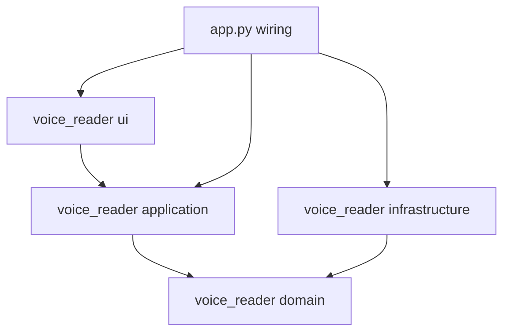
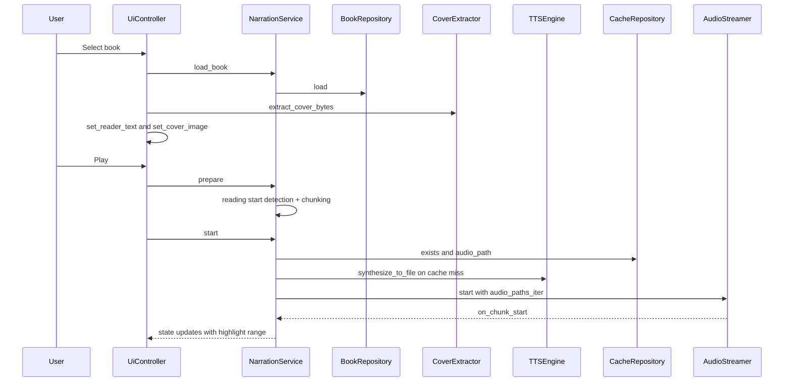

# Architecture

This document describes the current structure of the `voice_reader` codebase and how the application runs end-to-end.

Status note: the codebase is now **Kokoro-only** (no Coqui XTTS, no pyttsx3 fallback, no voice cloning).

## Recent operational notes (grounded in bug reports)

### Separator-only lines are treated as non-content

Some books contain separator-only lines (e.g. `---`) between scenes/chapters (example: [`The_Portal_Conundrum_COMPLETE.txt`](The_Portal_Conundrum_COMPLETE.txt:1)).

These lines must be treated as *non-content* so they:

- do not become playback candidates
- do not trigger TTS synthesis attempts that can produce no audio
- do not cause playback to appear to restart

This behavior is enforced at the domain sanitization boundary via [`SpokenTextSanitizer.sanitize()`](voice_reader/domain/services/spoken_text_sanitizer.py:28), which drops separator-only lines.

Additionally, narration failure handling persists a best-effort resume position before emitting ERROR from [`run()`](voice_reader/application/services/narration/run.py:24).

## High-level overview

- Entry point + wiring happens in [`app.py`](app.py:1), specifically [`main()`](app.py:55).
- UI is a PySide6 desktop app: [`MainWindow`](voice_reader/ui/main_window.py:38) is the widget tree; [`UiController`](voice_reader/ui/ui_controller.py:21) bridges UI events to application services.
- The primary orchestration service is [`NarrationService`](voice_reader/application/services/narration_service.py:36).
- Domain logic lives under [`voice_reader/domain`](voice_reader/domain:1) and is expressed as:
  - the document model ([`voice_reader/domain/document`](voice_reader/domain/document:1)), which decides what a book *is*: its sections, its blocks, what the pane shows and what the narrator speaks
  - pure services (chunking, reading-start detection, spoken-text sanitization)
  - protocols (interfaces) for IO-heavy concerns (TTS engines, audio playback, book loading, caching)
- Infrastructure adapters live under [`voice_reader/infrastructure`](voice_reader/infrastructure:1) and implement domain protocols.

## Module layout (by layer)

- UI layer: [`voice_reader/ui`](voice_reader/ui:1)
  - [`MainWindow`](voice_reader/ui/main_window.py:38): widgets, theming, highlighting, cover display
  - [`UiController`](voice_reader/ui/ui_controller.py:21): file picker, wiring signals, applying narration state to UI
  - To respect the 400-line guardrail, `UiController` is decomposed into focused helper modules: signal wiring ([`_ui_controller_wiring.py`](voice_reader/ui/_ui_controller_wiring.py:1)), book loading ([`_ui_controller_book_loading.py`](voice_reader/ui/_ui_controller_book_loading.py:1)), and playback/sections/chapters/bookmarks/state/seek/ideas handlers. Application-icon setup lives in [`_app_icon.py`](voice_reader/ui/_app_icon.py:1); first-run weight download is handled by [`model_download_dialog.py`](voice_reader/ui/model_download_dialog.py:1).

- Application layer: [`voice_reader/application`](voice_reader/application:1)
  - DTOs: [`NarrationState`](voice_reader/application/dto/narration_state.py:21), [`NarrationStatus`](voice_reader/application/dto/narration_state.py:9)
  - Services:
    - [`NarrationService`](voice_reader/application/services/narration_service.py:36): core orchestration
    - [`VoiceProfileService`](voice_reader/application/services/voice_profile_service.py:15): lists voices via repo
    - [`ChapterIndexService`](voice_reader/application/services/chapter_index_service.py:27): navigation anchors, from the model's sections where there is one. Only a book's major divisions become Next/Previous stops, ranked from the heading levels that book actually uses rather than from a fixed threshold, because a chapter sits at a different level in each book.
    - [`chapter_progress_label()`](voice_reader/application/services/chapter_progress.py:41): what the status line says, in chapters rather than in text fragments
  - Interfaces (ports):
    - [`CoverExtractor`](voice_reader/application/interfaces/cover_extractor.py:1): cover extraction port injected into UI

- Domain layer: [`voice_reader/domain`](voice_reader/domain:1)
  - Entities: [`Book`](voice_reader/domain/entities/book.py:1), [`TextChunk`](voice_reader/domain/entities/text_chunk.py:1), [`VoiceProfile`](voice_reader/domain/entities/voice_profile.py:1)
  - Protocols (interfaces):
    - [`BookRepository`](voice_reader/domain/interfaces/book_repository.py:1)
    - [`CacheRepository`](voice_reader/domain/interfaces/cache_repository.py:1)
    - [`TTSEngine`](voice_reader/domain/interfaces/tts_engine.py:11)
    - [`AudioStreamer`](voice_reader/domain/interfaces/audio_streamer.py:14)
    - [`VoiceProfileRepository`](voice_reader/domain/interfaces/voice_profile_repository.py:1)
  - Pure services:
    - [`ChunkingService`](voice_reader/domain/services/chunking_service.py:32) via [`ChunkingService.chunk_text()`](voice_reader/domain/services/chunking_service.py:37)
    - [`ReadingStartService`](voice_reader/domain/services/reading_start_service.py:23) via [`ReadingStartService.detect_start()`](voice_reader/domain/services/reading_start_service.py:29): still used by the 🧠 Sections bookmarks and the ideas index. Narration no longer consults it, see the document model below.
    - [`SpokenTextSanitizer`](voice_reader/domain/services/spoken_text_sanitizer.py:27) via [`SpokenTextSanitizer.sanitize()`](voice_reader/domain/services/spoken_text_sanitizer.py:28)
  - Document model: [`voice_reader/domain/document`](voice_reader/domain/document:1), pure and format independent
    - [`Document`](voice_reader/domain/document/model.py:123) → [`Section`](voice_reader/domain/document/model.py:90) → [`Block`](voice_reader/domain/document/model.py:34), plus [`TocEntry`](voice_reader/domain/document/model.py:69). `Section` is named so rather than `Chapter` because [`Chapter`](voice_reader/domain/entities/chapter.py:1) already owns navigation metadata, and not every division of a book is a chapter.
    - [`BlockKind`](voice_reader/domain/document/block_kind.py:21): the single policy for `is_displayed` and `is_spoken`, kept together so the pane and the narrator cannot drift apart
    - Format readers, each emitting drafts rather than offsets: [`markdown.py`](voice_reader/domain/document/markdown.py:1), [`pdf_lines.py`](voice_reader/domain/document/pdf_lines.py:1), [`plain_text.py`](voice_reader/domain/document/plain_text.py:1)
    - [`text_index.py`](voice_reader/domain/document/text_index.py:1): how extracted text is matched against the canonical text, shared by anchoring and narration planning
    - [`anchoring.py`](voice_reader/domain/document/anchoring.py:1): locates each draft in `normalized_text`
    - [`sectioning.py`](voice_reader/domain/document/sectioning.py:1), [`assembly.py`](voice_reader/domain/document/assembly.py:1): group anchored blocks into the finished document
    - [`reading_start.py`](voice_reader/domain/document/reading_start.py:1): where the body begins, for both the pane and the narrator
    - [`render_plan.py`](voice_reader/domain/document/render_plan.py:1): what the pane shows, and the source-to-render coordinate mapping
    - [`narration_plan.py`](voice_reader/domain/document/narration_plan.py:1): what the narrator speaks, as chunks in book coordinates

- Infrastructure layer: [`voice_reader/infrastructure`](voice_reader/infrastructure:1)
  - Books:
    - [`CalibreConverter`](voice_reader/infrastructure/books/converter.py:18) via [`CalibreConverter.convert_to_epub_if_needed()`](voice_reader/infrastructure/books/converter.py:22)
    - [`BookParser`](voice_reader/infrastructure/books/parser.py:20) via [`BookParser.parse()`](voice_reader/infrastructure/books/parser.py:21)
    - [`LocalBookRepository`](voice_reader/infrastructure/books/repository.py:16) via [`LocalBookRepository.load()`](voice_reader/infrastructure/books/repository.py:20)
    - [`CoverExtractor`](voice_reader/infrastructure/books/cover_extractor.py:25) via [`CoverExtractor.extract_cover_bytes()`](voice_reader/infrastructure/books/cover_extractor.py:26)
  - Cache:
    - [`FilesystemCacheRepository`](voice_reader/infrastructure/cache/filesystem_cache.py:12) via [`FilesystemCacheRepository.audio_path()`](voice_reader/infrastructure/cache/filesystem_cache.py:15)
  - TTS engines:
    - [`KokoroEngine`](voice_reader/infrastructure/tts/kokoro_engine.py:30) via [`KokoroEngine.synthesize_to_file()`](voice_reader/infrastructure/tts/kokoro_engine.py:71)
    - [`TTSEngineFactory`](voice_reader/infrastructure/tts/tts_engine_factory.py:1): Kokoro engine creation + fail-fast import checks for packaged builds
    - [`configure_espeak()`](voice_reader/infrastructure/tts/_espeak_setup.py:38): when no system phonemizer library is discoverable (packaged/sandboxed builds), points phonemizer at a bundled espeak-ng library + data directory so out-of-dictionary words can be phonemized; a working system install is never overridden. Called by [`KokoroEngine`](voice_reader/infrastructure/tts/kokoro_engine.py:133) before the lazy Kokoro import.
    - Voice profiles: built-in Kokoro voice IDs via [`KokoroVoiceProfileRepository`](voice_reader/infrastructure/tts/voice_profile_repository.py:19)
  - Audio playback:
    - [`SoundDeviceAudioStreamer`](voice_reader/infrastructure/audio/audio_streamer.py:72) via [`SoundDeviceAudioStreamer.start()`](voice_reader/infrastructure/audio/audio_streamer.py:111)

- Shared:
  - Paths + defaults: [`Config`](voice_reader/shared/config.py:21) via [`Config.from_project_root()`](voice_reader/shared/config.py:27) and [`Config.ensure_directories()`](voice_reader/shared/config.py:37)
  - Errors: [`voice_reader/shared/errors.py`](voice_reader/shared/errors.py:1)
  - Logging setup: [`voice_reader/shared/logging_utils.py`](voice_reader/shared/logging_utils.py:1)
  - Packaged runtime helpers (optional): [`configure_packaged_runtime()`](voice_reader/shared/external_runtime.py:109) adds sibling `ext/` and configures `hf-cache/`

## Document model invariants

The document model is the single answer to "what is in this book, and where".
Each invariant below is enforced by a test rather than by convention.

| Invariant | Why it holds | Enforced by |
| --- | --- | --- |
| **`normalized_text` is never rewritten.** Every block records a span into it; the model carries spans *into* the text rather than replacing it. | That string is the coordinate system for chunk spans, the chapter index, structural bookmarks, the ideas index, click-to-seek, persisted bookmarks, the resume position, the audio cache key and the derived `book_id`. Rewriting it silently orphans every bookmark a reader already has. | [`tests/domain/test_document_anchoring.py`](tests/domain/test_document_anchoring.py:1) |
| **A draft that cannot be located is dropped, never guessed at.** | Uncertainty degrades the confidence signal instead of corrupting offsets. Dropped drafts lower `covered_ratio`, and a low enough ratio is what tips the repository over to the unstructured fallback. | [`tests/domain/test_document_anchoring.py`](tests/domain/test_document_anchoring.py:1) |
| **Matching folds exactly what the extraction rewrote**, one character wide or dropped outright. | A draft is a whole paragraph of joined lines, so one unfolded character loses the paragraph around it, not just the word. Folding must widen what matches without making the offsets approximate. | [`tests/domain/test_document_anchoring.py`](tests/domain/test_document_anchoring.py:1), [`tests/domain/test_document_pdf_lines.py`](tests/domain/test_document_pdf_lines.py:1) |
| **Displayed and spoken are one policy**, held in [`BlockKind`](voice_reader/domain/document/block_kind.py:21). | The pane and the narrator answer the same questions. Deciding separately is how a folio the reader never sees becomes a folio the narrator reads aloud. | [`tests/domain/test_document_block_kind.py`](tests/domain/test_document_block_kind.py:1) |
| **A chunk says exactly what its span claims.** Chunks are cut from the source slice and then *located* back in it, never given calculated offsets. | `ChunkingService` normalises its input before measuring, so its own offsets drift wherever it collapses whitespace. Highlighting and click-to-seek read those offsets literally. | [`tests/domain/test_document_narration_plan.py`](tests/domain/test_document_narration_plan.py:1) |
| **A narration run never spans skipped content.** Blocks merge into a run only when they share a kind and nothing but whitespace separates them. | Merging is there to stop sentence-sized PDF blocks becoming sentence-sized utterances. Merging across a folio would produce a chunk whose span covers text nobody asked to hear. | [`tests/domain/test_document_narration_plan.py`](tests/domain/test_document_narration_plan.py:1) |
| **There is one code path, never two.** Extraction that fails its confidence check degrades to [`Document.unstructured()`](voice_reader/domain/document/model.py:139), a real model holding one paragraph. | The renderer and the narrator have no special case for "no model", so the fallback cannot rot from disuse. | [`tests/infrastructure/test_book_repository.py`](tests/infrastructure/test_book_repository.py:1) |

### Confidence guardrail

[`LocalBookRepository`](voice_reader/infrastructure/books/repository.py:33) keeps the
structured model only when it accounts for at least `_MIN_COVERED_RATIO` of the
source and finds at least `_MIN_DISPLAYED_RATIO` of real body content.
Artefacts count towards coverage, because recognising a page number *is*
understanding the text: a contents-heavy book is not a badly parsed one.

## Dependency direction

The intent is “clean architecture” style dependency flow:

- UI depends on Application.
- Application depends on Domain.
- Infrastructure depends on Domain (implements its protocols).
- The entrypoint wires concrete infrastructure implementations into application services.

Hard-enforced constraints (tests): see [`ARCHITECTURE_CONSTRAINTS.md`](ARCHITECTURE_CONSTRAINTS.md:1).

## Runtime flow (end-to-end)

The runtime is driven by UI events handled by [`UiController`](voice_reader/ui/ui_controller.py:21), which delegates to [`NarrationService`](voice_reader/application/services/narration_service.py:36).

### 1) App startup and wiring

Startup is in [`main()`](app.py:55):

1. Load config + ensure directories via [`Config.from_project_root()`](voice_reader/shared/config.py:27) and [`Config.ensure_directories()`](voice_reader/shared/config.py:37)
2. Cache policy: clear `cache/` on launch unless `NARRATEX_PRESERVE_CACHE=1` (see [`main()`](app.py:55))
2.5. Packaged runtime support: before importing heavy deps, call [`configure_packaged_runtime()`](voice_reader/shared/external_runtime.py:109) to:
   - add a sibling `ext/` folder to `sys.path` (optional distribution strategy)
   - point HuggingFace/Transformers caches at a sibling `hf-cache/` (optional)
3. Instantiate infrastructure adapters:
   - books: [`CalibreConverter`](voice_reader/infrastructure/books/converter.py:18), [`BookParser`](voice_reader/infrastructure/books/parser.py:20), [`LocalBookRepository`](voice_reader/infrastructure/books/repository.py:16)
   - cache: [`FilesystemCacheRepository`](voice_reader/infrastructure/cache/filesystem_cache.py:12)
- voices: Kokoro built-in voice IDs via [`KokoroVoiceProfileRepository`](voice_reader/infrastructure/tts/voice_profile_repository.py:19) + [`VoiceProfileService`](voice_reader/application/services/voice_profile_service.py:15)
- tts: Kokoro engine via [`TTSEngineFactory.create()`](voice_reader/infrastructure/tts/tts_engine_factory.py:27)
- audio: [`SoundDeviceAudioStreamer`](voice_reader/infrastructure/audio/audio_streamer.py:72)
4. Create the application orchestrator [`NarrationService`](voice_reader/application/services/narration_service.py:36)
5. Create UI: [`MainWindow`](voice_reader/ui/main_window.py:38) + [`UiController`](voice_reader/ui/ui_controller.py:21)
6. Show window via `window.show()`, then center it on the primary screen via [`center_window_on_screen()`](voice_reader/shared/startup_ui.py:126). Centering is best-effort (swallows exceptions so fakes/tests are unaffected).
7. Pre-warm the TTS model on a background thread via [`NarrationService.startup_warmup()`](voice_reader/application/services/narration_service.py:194) (see [`main()`](app.py:371)). This synthesises a single token to load the model into memory, emitting `SYNTHESIZING` state so the progress bar animates, so the first Play does not pay the model-load cost. Best-effort: failures are swallowed.

### 2) Book selection and cover handling

When the user selects a book:

- File picker is opened by [`UiController.select_book()`](voice_reader/ui/ui_controller.py:77)
- The book is loaded via [`NarrationService.load_book()`](voice_reader/application/services/narration_service.py:78)
  - which delegates to [`LocalBookRepository.load()`](voice_reader/infrastructure/books/repository.py:20)
    - which may convert via [`CalibreConverter.convert_to_epub_if_needed()`](voice_reader/infrastructure/books/converter.py:22)
    - then parses via [`BookParser.parse()`](voice_reader/infrastructure/books/parser.py:21)
- The UI text view is updated immediately (`setPlainText`) via [`MainWindow.set_reader_text()`](voice_reader/ui/main_window.py:284)

### 2.5) Click-to-seek reading position (chunk-relative)

The reader supports **chunk-relative seeking**: clicking in the displayed text
restarts narration from the nearest *playback candidate* chunk boundary.

Key properties:

- Input is a UI cursor position that resolves to an absolute character offset
  into `normalized_text`.
- Seeking resolves **offset → playback-candidate index** using the same candidate
  filtering semantics as narration playback.
- No raw audio timestamp seeking is performed.
- Highlighting remains driven by the narration state (`highlight_start/end`) and
  uses the same selection/highlight mechanism as regular playback.
- Resume persistence is updated immediately on click (product requirement).

Implementation wiring:

- The reader widget is [`SeekableTextEdit`](voice_reader/ui/seekable_text_edit.py:17)
  (a subclass of `QTextEdit`) and emits `seek_requested(char_offset)`.
- [`MainWindow`](voice_reader/ui/main_window.py:38) forwards this as
  `reader_seek_requested(int)`.
- [`UiController`](voice_reader/ui/ui_controller.py:21) receives the signal and
  delegates to [`seek_to_char_offset()`](voice_reader/ui/_ui_controller_seek.py:21).
- The handler:
  - builds navigation chunks using [`NavigationChunkService.build_chunks()`](voice_reader/application/services/navigation_chunk_service.py:51)
  - maps `char_offset` → candidate index via
    [`resolve_playback_index_for_char_offset()`](voice_reader/application/services/narration/prepare.py:13)
  - restarts playback via `stop(persist_resume=False)` → `prepare(start_playback_index=...)` → `start()`.
  - persists resume immediately via [`BookmarkService.save_resume_position()`](voice_reader/application/services/bookmark_service.py:39)
    using the resolved chunk start offset and candidate index.

Cover extraction is best-effort and UI-facing:

- [`UiController.select_book()`](voice_reader/ui/ui_controller.py:77) calls [`CoverExtractor.extract_cover_bytes()`](voice_reader/infrastructure/books/cover_extractor.py:26)
- [`MainWindow.set_cover_image()`](voice_reader/ui/main_window.py:307) decodes the returned bytes into a `QImage` and renders a scaled `QPixmap`

Important layering note:

- UI does **not** import Infrastructure directly. [`UiController`](voice_reader/ui/ui_controller.py:21) depends on the application port [`CoverExtractor`](voice_reader/application/interfaces/cover_extractor.py:1) and receives a concrete implementation via the composition root in [`main()`](app.py:177).

Cover extraction strategy (ordered):

1. Prefer Calibre-style sidecar `cover.jpg`/`cover.png` next to the book
2. Else extract embedded cover:
   - EPUB: ebooklib cover APIs + heuristics
   - PDF: first page raster via PyMuPDF
3. If Kindle format: attempt conversion to EPUB via Calibre and then extract from EPUB

Implementation details are documented in [`CoverExtractor.extract_cover_bytes()`](voice_reader/infrastructure/books/cover_extractor.py:34) and the strategy modules under [`voice_reader/infrastructure/books/cover`](voice_reader/infrastructure/books/cover:1).

### 3) Preparing narration (chunking + start detection)

When the user hits Play:

- [`UiController.play()`](voice_reader/ui/ui_controller.py:155) triggers orchestration:
  - choose a voice profile from the dropdown
  - call [`NarrationService.prepare()`](voice_reader/application/services/narration_service.py:103)

Preparation does:

1. Choose a sensible narration start point.
- If a saved resume position exists for the book, narration resumes using the stored absolute `char_offset`.
   - The resume `char_offset` is mapped into the *current* playback candidate list using [`resolve_playback_index_for_char_offset()`](voice_reader/application/services/narration/prepare.py:13) inside [`prepare()`](voice_reader/application/services/narration/prepare.py:47).
   - The stored `chunk_index` is treated as non-authoritative because chunking start/candidate filtering can change between runs.
- If **no** resume position exists (first-time start), the UI prefers the *first* deterministic 🧠 Sections bookmark as the start point (computed via [`compute_structural_bookmarks()`](voice_reader/ui/structural_bookmarks_helpers.py:39)). This aligns “start from scratch” playback with what the Sections dialog shows.
   - If no Sections can be computed, the start comes from the document model via [`reading_start_offset()`](voice_reader/domain/document/reading_start.py:88). That is the same offset the reading pane opens on, so the two cannot disagree about where the book begins.

2. Build chunks from the document model via [`build_narration_chunks()`](voice_reader/domain/document/narration_plan.py:83)
   - Only [`Block.is_spoken`](voice_reader/domain/document/model.py:64) blocks are narrated, so the folios, running heads, contents entries and back-of-book index the pane hides are never read aloud.
   - Consecutive blocks merge into a *run* when they share a kind and only whitespace separates them, then the run is chunked. Without this, a PDF's sentence-sized blocks become sentence-sized utterances.
   - Each chunk is then located back in its run through [`text_index.locate()`](voice_reader/domain/document/text_index.py:60), so its span holds exactly the text it speaks.
   - The chunk list can then be *filtered* for navigation purposes (without mutating
     the text buffer or changing offsets) by [`NavigationChunkService.build_chunks()`](voice_reader/application/services/navigation_chunk_service.py:49).
   - If `skip_essay_index=True`, the service detects an `Essay Index` block and
     removes chunks fully contained within that span. Importantly, the span ends
     at the first *clean structural heading* following `Essay Index` (e.g.
     `INTRODUCTION`, `PROLOGUE`, `CHAPTER I`), so a real Introduction that appears
     after the index is **not** skipped.
   - Note: `Essay Index` and similar marker headings are treated as *front matter*
     only when they occur before the first real body marker. Some books include an
     `Essay Index` inside the body (e.g. after `PROLOGUE`); this must not cause the
     🧠 Sections list (structural bookmarks) to jump forward to `CHAPTER 1`.
3. Store chunk start/end character offsets so the UI can highlight the currently spoken chunk

#### Structural bookmarks (“🧠 Sections”) pipeline

The 🧠 Sections list is a deterministic set of *structural bookmarks* derived from the normalized book text. It is used by:

- the Sections dialog controller ([`open_structural_bookmarks_dialog()`](voice_reader/ui/_ui_controller_sections.py:18))
- first-time “Play from scratch” behavior ([`play()`](voice_reader/ui/_ui_controller_playback.py:57))

Computation entry points:

- UI helper: [`compute_structural_bookmarks()`](voice_reader/ui/structural_bookmarks_helpers.py:39)
- Application service: [`StructuralBookmarkService.build_for_loaded_book()`](voice_reader/application/services/structural_bookmarks/service.py:71)

At a high level, the service:

1. Establishes a safe boundary between front matter / TOC and body:
   - body start cutoff via [`detect_body_start_offset()`](voice_reader/application/services/structural_bookmarks/front_matter.py:54)
   - TOC end cutoff via [`detect_toc_end_offset()`](voice_reader/application/services/structural_bookmarks/toc_end.py:78)

2. Collects *candidate heading labels* from multiple sources:
   - parsed chapter-like candidates adapted by [`StructuralBookmarkService._adapt_chapter_like_candidates()`](voice_reader/application/services/structural_bookmarks/service.py:372)
   - text scanning via [`scan_structural_headings()`](voice_reader/application/services/structural_bookmarks/text_scan.py:18) and [`extract_heading_labels_from_text()`](voice_reader/application/services/structural_bookmarks/service.py:42)

3. Classifies and resolves each label to a stable navigation anchor:
   - heading classification via [`classify_heading()`](voice_reader/application/services/structural_bookmarks/classification.py:33) (includes `Book N` headings)
   - exact full-line matching via [`find_exact_heading_occurrences()`](voice_reader/application/services/structural_bookmarks/occurrences.py:21)
   - body-aware selection via [`choose_best_occurrence()`](voice_reader/application/services/structural_bookmarks/occurrences.py:216)

4. Applies post-processing to reduce UI noise and handle omnibus-style books:
   - suppress duplicated title-only sections via [`suppress_redundant_title_sections()`](voice_reader/application/services/structural_bookmarks/postprocess.py:17)
   - suppress stray title-case headings *between* chapters via [`suppress_sections_between_chapters()`](voice_reader/application/services/structural_bookmarks/postprocess.py:59)
   - inject additional `Prologue` entries per `Book N` span when present via [`inject_prologue_after_each_book()`](voice_reader/application/services/structural_bookmarks/postprocess.py:86)

Key behaviors this pipeline is designed to preserve:

- “Prologue” is included when present and is the first section for first-time playback.
- TOC duplicates (dotted-leader/page-number styles, wrapped entries, and “glued” page tokens) are excluded from bookmark anchors.
- Omnibus PDFs/EPUBs can contain multiple `Book N` segments, each with its own `Prologue`; these must appear as separate entries.

Regression tests for these cases live in:

- Move Space boundary regressions: [`test_front_matter_body_start_regression_move_space.py`](tests/application/test_front_matter_body_start_regression_move_space.py:1)
- Structural-bookmarks axioms (incl. Book headings): [`test_structural_bookmark_service_axioms.py`](tests/application/test_structural_bookmark_service_axioms.py:1)
- General service behavior: [`test_structural_bookmark_service.py`](tests/application/test_structural_bookmark_service.py:1)

Resume persistence (auto-bookmarking) rules:

- The app saves resume position during pause/stop/app-exit via [`maybe_save_resume_position()`](voice_reader/application/services/narration/persistence.py:13).
- A resume JSON file is only created after playback has actually started at least one chunk.
  - Primary signal: [`audio_playback.play()`](voice_reader/application/services/narration/audio_playback.py:18) sets `NarrationService._played_any_chunk = True` in its `on_chunk_start` callback (see [`on_start()`](voice_reader/application/services/narration/audio_playback.py:37)).
  - Secondary signal: if the callback cannot fire (exit race / synthetic state), persistence also infers “played” from `NarrationState` fields.
- On Windows, the JSON write is performed by [`JSONBookmarkRepository.save_resume_position()`](voice_reader/infrastructure/bookmarks/json_bookmark_repository.py:232) under the configured `bookmarks_dir` (see [`Config.from_project_root()`](voice_reader/shared/config.py:35)).

Click-to-seek persistence note:

- Click-to-seek intentionally persists resume immediately from the UI handler
  (before audio starts) by calling [`BookmarkService.save_resume_position()`](voice_reader/application/services/bookmark_service.py:39).
  This is a product-level behavior and is separate from the playback-driven
  guard in [`maybe_save_resume_position()`](voice_reader/application/services/narration/persistence.py:13).

Additional hardening:

- On narration failure, we attempt to persist resume (best-effort) before emitting ERROR so retrying Play does not restart from the beginning (see [`run()`](voice_reader/application/services/narration/run.py:24)).

### 4) Synthesis, caching, and playback

Starting narration spawns a background thread via [`NarrationService.start()`](voice_reader/application/services/narration_service.py:172), which runs the narration runner [`run()`](voice_reader/application/services/narration/run.py:24).

Core responsibilities of the narration runner (see [`run()`](voice_reader/application/services/narration/run.py:24)):

- Build a list of playback candidates (skipping chunks whose sanitized `speak_text` is empty)
- Sanitize spoken text (remove outline numbering, normalize punctuation, expand initialisms, and drop separator-only lines) via [`SpokenTextSanitizer.sanitize()`](voice_reader/domain/services/spoken_text_sanitizer.py:28)
- For each chunk:
  - compute a deterministic cache location via [`FilesystemCacheRepository.audio_path()`](voice_reader/infrastructure/cache/filesystem_cache.py:15)
  - on cache miss: call [`TTSEngine.synthesize_to_file()`](voice_reader/domain/interfaces/tts_engine.py:16)
  - publish ready-to-play WAV paths into a bounded queue
- Start audio playback via [`SoundDeviceAudioStreamer.start()`](voice_reader/infrastructure/audio/audio_streamer.py:111)
  - the streamer calls back into the runner to update narration state (chunk boundaries + highlight spans)

Error behavior:

- If a mid-book synthesis/playback error occurs, the runner persists a best-effort resume position before entering ERROR state (see [`run()`](voice_reader/application/services/narration/run.py:24)).

Notable performance and UX choices:

- Synthesis is allowed to run ahead of playback (bounded by env var `NARRATEX_MAX_AHEAD_CHUNKS`) to reduce gaps.
- Optional prefetch delay before starting playback (env var `NARRATEX_PREFETCH_CHUNKS`) to smooth the first chunk transitions.
- In Kokoro-native mode, optional parallel synthesis (env var `NARRATEX_KOKORO_WORKERS`) publishes results in-order.

### 5) UI state updates and highlighting

`NarrationService` publishes state changes as [`NarrationState`](voice_reader/application/dto/narration_state.py:21) to registered listeners.

- [`UiController`](voice_reader/ui/ui_controller.py:21) registers a listener and applies updates on the Qt thread.
- Highlighting uses `highlight_start`/`highlight_end` and is rendered via [`MainWindow.highlight_range()`](voice_reader/ui/main_window.py:287).

## TTS engine selection and voice profiles

The app is **Kokoro-only**.

- The runtime always uses [`KokoroEngine`](voice_reader/infrastructure/tts/kokoro_engine.py:30), created by [`TTSEngineFactory.create()`](voice_reader/infrastructure/tts/tts_engine_factory.py:27).
- Voice choices come from [`KokoroVoiceProfileRepository`](voice_reader/infrastructure/tts/voice_profile_repository.py:19) and are shown with friendly labels by [`UiController._voice_label()`](voice_reader/ui/ui_controller.py:135).
- Voice profiles are Kokoro voice IDs (e.g. `bf_emma`, `am_michael`) and do not require reference audio.

## Concurrency model

- UI runs on Qt main thread.
- Narration runs on a background thread started by [`NarrationService.start()`](voice_reader/application/services/narration_service.py:156).
- Audio playback (`sounddevice` + `soundfile`) uses internal producer/player threads inside [`SoundDeviceAudioStreamer`](voice_reader/infrastructure/audio/audio_streamer.py:72).
- In Kokoro-native mode, TTS synthesis can be parallelized by multiple worker threads and a publisher thread (see [`run()`](voice_reader/application/services/narration/run.py:24)).

## Packaging note (Windows)

The Windows build goal is a Windows GUI executable built with PyInstaller via [`buildexe.py`](buildexe.py:1).

The current approach is a **onedir** build (fast + predictable):

- `dist-pyinstaller/NarrateX/NarrateX.exe`
- `dist-pyinstaller/NarrateX/_internal/…` (PyInstaller runtime + bundled packages)

Optional distribution layout supported at runtime (not required in dev mode):

- `dist-pyinstaller/NarrateX/ext/` for heavy wheels placed beside the exe (see [`add_external_site_packages()`](voice_reader/shared/external_runtime.py:49))
- `dist-pyinstaller/NarrateX/hf-cache/` for pre-downloaded HuggingFace assets (see [`configure_huggingface_cache()`](voice_reader/shared/external_runtime.py:86))

The build bundles:

- Python runtime + dependencies
- PySide6 Qt plugins required for the UI
- the application icon ([`narratex.ico`](narratex.ico:1))

Kokoro model weights are resolved at runtime by Kokoro/HuggingFace unless you pre-populate `hf-cache/`.

## Packaging note (Linux)

Linux ships two build paths:

- **Flatpak** (sandboxed) via [`build_flatpak.sh`](build_flatpak.sh:1), producing app id `com.oliverernster.narratex`. Because the sandbox has no system libraries, the manifest bundles the runtime pieces narration needs:
  - the **PortAudio** backend required by `sounddevice` for audio output
  - the **spaCy `en_core_web_sm`** model required by misaki (Kokoro's grapheme-to-phoneme stage); without it misaki would attempt a network download at first synthesis and fail in the read-only sandbox
  - an **espeak-ng** phonemizer (via `espeakng_loader`), located at runtime by [`configure_espeak()`](voice_reader/infrastructure/tts/_espeak_setup.py:38) so out-of-dictionary words narrate instead of failing
- **Native onedir** via [`buildlinux.py`](buildlinux.py:1) (PyInstaller), producing `dist-pyinstaller/NarrateX/`.

Source-installation prerequisites per distribution are documented in [`LINUX-INSTALLATION.md`](LINUX-INSTALLATION.md:1).

## Tests: mapping to layers

Tests are organized to mirror the architecture.

- UI layer tests: [`tests/ui`](tests/ui:1)
  - smoke + controller semantics (play/pause/highlight, state application)

- Application layer tests: [`tests/application`](tests/application:1)
  - orchestration and service behavior:
    - [`tests/application/test_narration_service.py`](tests/application/test_narration_service.py:1)
    - [`tests/application/test_tts_engine_factory.py`](tests/application/test_tts_engine_factory.py:1)
    - [`tests/application/test_voice_profile_service.py`](tests/application/test_voice_profile_service.py:1)

- Domain layer tests: [`tests/domain`](tests/domain:1)
  - pure logic (no IO):
    - [`tests/domain/test_chunking_service.py`](tests/domain/test_chunking_service.py:1)
    - [`tests/domain/test_reading_start_service.py`](tests/domain/test_reading_start_service.py:1)
    - [`tests/domain/test_spoken_text_sanitizer.py`](tests/domain/test_spoken_text_sanitizer.py:1)
  - the document model, one file per module (`tests/domain/test_document_*.py`), covering anchoring, block kinds, the format readers, sectioning, the reading start, the render plan and the narration plan

- Infrastructure layer tests: [`tests/infrastructure`](tests/infrastructure:1)
  - adapters and IO boundaries (often via stubs/fakes):
    - book parsing/conversion/cover extraction
    - cache repository
    - audio streamer behavior
    - TTS adapter wrappers

- Shared tests: [`tests/shared`](tests/shared:1)
  - config + logging utilities

## End-to-end sequence (conceptual)

