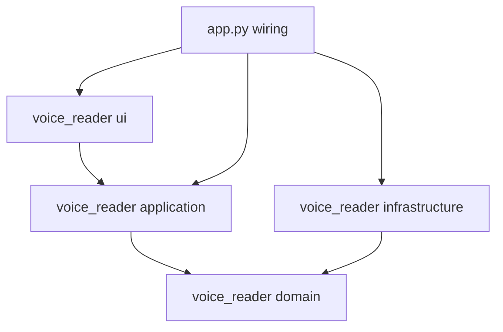
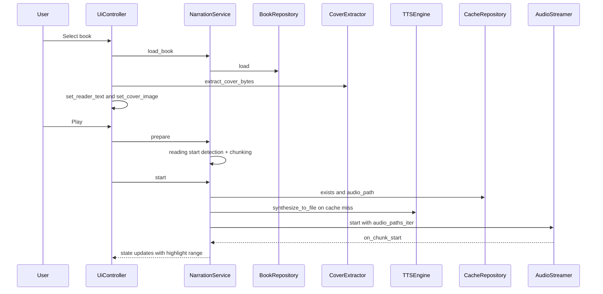

# Architecture

This document describes the current structure of the `voice_reader` codebase and how the application runs end-to-end.

Status note: the codebase is **Kokoro-only** (no Coqui XTTS, no pyttsx3 fallback, no voice cloning).

## Invariants

These are the properties the codebase holds to. Each is enforced by a test rather than by
convention, so the enforcing test is named alongside it. Everything further down this document is
description; this section is the contract.

### Structural invariants

| Invariant | Why it holds | Enforced by |
| --- | --- | --- |
| **Dependencies point inward.** UI depends on Application, Application on Domain, Infrastructure on Domain. UI never imports Infrastructure and Domain imports no other layer. | The playback core is the part that must not stutter, so nothing above it may reach into it. A pure Domain is also the only part that can be reasoned about without a Qt event loop or an audio device. | [`tests/structural/test_layering_rules.py`](tests/structural/test_layering_rules.py) |
| **Only whitelisted composition roots wire Infrastructure into Application.** | Wiring scattered through the tree is how a layer boundary quietly becomes decorative. The whitelist makes each new root a deliberate decision. | [`tests/structural/test_composition_roots.py`](tests/structural/test_composition_roots.py) |
| **Every in-scope module is at most 400 physical lines.** Delivery scripts are exempt by name. | A cap forces cohesive extraction rather than god modules. The exemption is listed rather than left to chance. | [`tests/structural/test_loc_limits.py`](tests/structural/test_loc_limits.py) |
| **No in-scope module sits in the 5% danger band**, 381 to 399 lines. A file that enters it is taken to 350 rather than left just under the cap. | A file at 399 passes the cap and then fails on the next edit made to it, for a reason that has nothing to do with that edit. Catching the band stops the bad state being reachable instead of noticing it afterwards. The band is derived from the cap in the test, so the two numbers cannot drift apart. | [`tests/structural/test_loc_limits.py`](tests/structural/test_loc_limits.py) |
| **Narration chunks are always built from a document model**, never assembled ad hoc. | The document model is the single answer to what a book contains and where. A second path for building chunks would be a second answer. | [`tests/structural/test_narration_contracts.py`](tests/structural/test_narration_contracts.py) |
| **The version is written once.** `VERSION` at the repo root is the source; the package reads it, `pyproject.toml` reads it and the site pages carry tokens stamped from it. | A number copied into a second place is a number that will disagree with the first. | [`tests/test_version_source.py`](tests/test_version_source.py) |
| **Every icon is derived from one master.** `narratex.png` is the master of the application mark; the eight staged sizes, the Windows `.ico` and the five copies the site needs are all emitted by [`generate_icons.py`](generate_icons.py) and none is hand-edited. Each button picture has its own master in `assets/`, reduced by the same script into `voice_reader/ui/artwork/`; every master has exactly one name in [`Artwork`](voice_reader/ui/artwork.py). | A hand-touched frame is a frame that stops matching the others, silently, in whichever size nobody looks at. Deriving each size straight from the master rather than resizing a resize is also what keeps the 16 and 24 pixel frames legible. | [`tests/structural/test_icons_match_master.py`](tests/structural/test_icons_match_master.py) |
| **The interface draws no emoji, nor does the setup program.** Every picture is shipped artwork, built through one factory ([`_icon_buttons.py`](voice_reader/ui/_icon_buttons.py)) that gives each button the same box, the same rounded-square interaction ring and a tooltip naming what it does. | An emoji renders differently on every platform (the flags came out as boxed letters on Windows) and sits at the emoji font's own baseline rather than the button's centre. One factory is what keeps the buttons matched by construction rather than by care. | [`tests/structural/test_no_emoji.py`](tests/structural/test_no_emoji.py), [`tests/ui/test_artwork_controls.py`](tests/ui/test_artwork_controls.py) |
| **A pane is never a stop and never wears a ring.** Panels, frames and picture labels are `NoFocus` at construction ([`as_pane()`](voice_reader/ui/pane_focus.py)); a text view is reachable only by Tab and only while it overflows ([`follow_overflow()`](voice_reader/ui/pane_focus.py)); no stylesheet rule rings a text view, an item view or a container; and a dialog holding a text view opens on its first control ([`FirstStopDialog`](voice_reader/ui/first_stop_dialog.py)). | A ring round a whole page tells the reader nothing they can act on. Tab alone must reach a long text, since otherwise the keyboard could not scroll it; neither a click nor a dialog merely opening may outline it. | [`tests/ui/test_panes_are_not_stops.py`](tests/ui/test_panes_are_not_stops.py), [`tests/structural/test_focus_ring_selectors.py`](tests/structural/test_focus_ring_selectors.py) |
| **Read-through text reads itself at one pace.** The Guide and the licence texts wear one [`AutoScroller`](voice_reader/ui/auto_scroller.py) whose constants belong to the class, never to a dialog; it refuses a `QPlainTextEdit`, whose scrollbar counts lines rather than pixels. The book in the reading pane never wears it. | A surface with its own pace means the pace is wrong everywhere. A line-counted scrollbar turned one reading step into a whole line and the licences raced. | [`tests/ui/test_help_guide_and_panes.py`](tests/ui/test_help_guide_and_panes.py) |
| **Tooltips show over an inactive window.** One application-wide filter ([`inactive_tooltips.py`](voice_reader/ui/inactive_tooltips.py)) sets `WA_AlwaysShowToolTips` on every top-level window as it is shown, dialogs and message boxes included; both composition roots, [`app.py`](app.py) and [`installer/app.py`](installer/app.py), install it straight after creating the `QApplication`. | Qt Widgets shows a tooltip only over the active window unless that window carries the attribute, so hovering a button while another program had focus showed nothing. A filter marks each window as it appears, so no window has to remember to opt in. | [`tests/ui/test_inactive_tooltips.py`](tests/ui/test_inactive_tooltips.py), [`tests/test_app_main.py`](tests/test_app_main.py) |
| **The shelf never starts a process to draw a cover.** [`ShelfCoverReader`](voice_reader/infrastructure/shelf/cover_reader.py) reads a sidecar, a Kindle header or an EPUB's or PDF's own picture and nothing else; Calibre runs only on the path that opens a book for reading. | One `ebook-convert` measured 2.3 seconds a book, which is 54 minutes over a library of 2800 files. A cover that cannot be had cheaply is a placeholder bearing the title and author, not a conversion. | [`tests/infrastructure/shelf/test_cover_reader_and_thumbnailer.py`](tests/infrastructure/shelf/test_cover_reader_and_thumbnailer.py) |
| **Muted is the volume at zero, not a second state.** The speaker button ([`volume_mute.py`](voice_reader/ui/volume_mute.py)) drops the slider to zero and puts the last audible level back; its picture follows the level wherever the level came from. | The audio, the saved preference and the slider already share one number. A separate mute flag would be a second answer to "is it audible" that could disagree with the first. | [`tests/ui/test_volume_mute.py`](tests/ui/test_volume_mute.py) |

### Document model invariants

The document model is the single answer to "what is in this book and where".

| Invariant | Why it holds | Enforced by |
| --- | --- | --- |
| **`normalized_text` is never rewritten.** Every block records a span into it; the model carries spans *into* the text rather than replacing it. | That string is the coordinate system for chunk spans, the chapter index, structural bookmarks, the ideas index, click-to-seek, persisted bookmarks, the resume position, the audio cache key and the derived `book_id`. Rewriting it silently orphans every bookmark a reader already has. | [`tests/domain/test_document_anchoring.py`](tests/domain/test_document_anchoring.py) |
| **A draft that cannot be located is dropped, never guessed at.** | Uncertainty degrades the confidence signal instead of corrupting offsets. Dropped drafts lower `covered_ratio` and a low enough ratio is what tips the repository over to the unstructured fallback. | [`tests/domain/test_document_anchoring.py`](tests/domain/test_document_anchoring.py) |
| **Matching folds exactly what the extraction rewrote**, one character wide or dropped outright. | A draft is a whole paragraph of joined lines, so one unfolded character loses the paragraph around it, not just the word. Folding must widen what matches without making the offsets approximate. | [`tests/domain/test_document_anchoring.py`](tests/domain/test_document_anchoring.py), [`tests/domain/test_document_pdf_lines.py`](tests/domain/test_document_pdf_lines.py) |
| **Displayed and spoken are one policy**, held in [`BlockKind`](voice_reader/domain/document/block_kind.py). | The pane and the narrator answer the same questions. Deciding separately is how a folio the reader never sees becomes a folio the narrator reads aloud. | [`tests/domain/test_document_block_kind.py`](tests/domain/test_document_block_kind.py) |
| **A chunk says exactly what its span claims.** Chunks are cut from the source slice and then *located* back in it, never given calculated offsets. | `ChunkingService` normalises its input before measuring, so its own offsets drift wherever it collapses whitespace. Highlighting and click-to-seek read those offsets literally. | [`tests/domain/test_document_narration_plan.py`](tests/domain/test_document_narration_plan.py) |
| **A narration run never spans skipped content.** Blocks merge into a run only when they share a kind and nothing but whitespace separates them. | Merging is there to stop sentence-sized PDF blocks becoming sentence-sized utterances. Merging across a folio would produce a chunk whose span covers text nobody asked to hear. | [`tests/domain/test_document_narration_plan.py`](tests/domain/test_document_narration_plan.py) |
| **There is one code path, never two.** Extraction that fails its confidence check degrades to [`Document.unstructured()`](voice_reader/domain/document/model.py), a real model holding one paragraph. | The renderer and the narrator have no special case for "no model", so the fallback cannot rot from disuse. | [`tests/infrastructure/test_book_repository.py`](tests/infrastructure/test_book_repository.py) |
| **Separator-only lines are non-content.** A line that is only `---`, `___` or `***` never becomes a playback candidate, never reaches synthesis and never makes playback appear to restart. | Separator runs are common between scenes in plain-text books. Synthesising one produces no audio, which reads to the listener as a stall. | [`tests/domain/test_spoken_text_sanitizer.py`](tests/domain/test_spoken_text_sanitizer.py) |

The sanitisation boundary that drops separator-only lines is
[`SpokenTextSanitizer.sanitize()`](voice_reader/domain/services/spoken_text_sanitizer.py). Narration
failure handling persists a best-effort resume position before emitting ERROR from
[`run()`](voice_reader/application/services/narration/run.py), so retrying Play does not restart
from the beginning.

### Confidence guardrail

[`LocalBookRepository`](voice_reader/infrastructure/books/repository.py) keeps the
structured model only when it accounts for at least `_MIN_COVERED_RATIO` of the
source and finds at least `_MIN_DISPLAYED_RATIO` of real body content.
Artefacts count towards coverage, because recognising a page number *is*
understanding the text: a contents-heavy book is not a badly parsed one.

## High-level overview

- Entry point + wiring happens in [`app.py`](app.py), specifically [`main()`](app.py).
- UI is a PySide6 desktop app: [`MainWindow`](voice_reader/ui/main_window.py) is the widget tree; [`UiController`](voice_reader/ui/ui_controller.py) bridges UI events to application services.
- The primary orchestration service is [`NarrationService`](voice_reader/application/services/narration_service.py).
- Domain logic lives under [`voice_reader/domain`](voice_reader/domain) and is expressed as:
  - the document model ([`voice_reader/domain/document`](voice_reader/domain/document)), which decides what a book *is*: its sections, its blocks, what the pane shows and what the narrator speaks
  - pure services (chunking, reading-start detection, spoken-text sanitization)
  - protocols (interfaces) for IO-heavy concerns (TTS engines, audio playback, book loading, caching)
- Infrastructure adapters live under [`voice_reader/infrastructure`](voice_reader/infrastructure) and implement domain protocols.

## Module layout (by layer)

- UI layer: [`voice_reader/ui`](voice_reader/ui)
  - [`MainWindow`](voice_reader/ui/main_window.py): widgets, theming, highlighting, cover display
  - [`UiController`](voice_reader/ui/ui_controller.py): file picker, wiring signals, applying narration state to UI
  - To respect the 400-line guardrail, `UiController` is decomposed into focused helper modules: signal wiring ([`_ui_controller_wiring.py`](voice_reader/ui/_ui_controller_wiring.py)), book-load orchestration ([`_ui_controller_book_loading.py`](voice_reader/ui/_ui_controller_book_loading.py)) with its in-process compute fallback ([`_book_load_compute.py`](voice_reader/ui/_book_load_compute.py)), the voice picker ([`_ui_controller_voices.py`](voice_reader/ui/_ui_controller_voices.py)), book removal ([`_ui_controller_book_removal.py`](voice_reader/ui/_ui_controller_book_removal.py)) and playback/sections/chapters/bookmarks/state/seek/ideas handlers. `MainWindow` construction is likewise split: the controls rows (selection, voice picker toggles, transport, chapter nav) live in [`_main_window_controls.py`](voice_reader/ui/_main_window_controls.py) with the rest in [`_main_window_build.py`](voice_reader/ui/_main_window_build.py). The strip along the window's foot ([`bottom_tray.py`](voice_reader/ui/bottom_tray.py)) holds the donate button, a separator and the UI and Backend licence buttons; donate hands its address to the desktop through the one seam [`links.py`](voice_reader/ui/links.py), so the application never fetches the page itself. Application-icon setup lives in [`_app_icon.py`](voice_reader/ui/_app_icon.py); the Help menu offers the Guide ([`guide_dialog.py`](voice_reader/ui/guide_dialog.py)) then About, with the About and licence dialogs in [`_help_dialogs.py`](voice_reader/ui/_help_dialogs.py) (re-exported by [`window_helpers.py`](voice_reader/ui/window_helpers.py)); the Guide and both licence dialogs derive [`FirstStopDialog`](voice_reader/ui/first_stop_dialog.py), take their text's focus rule from [`pane_focus.py`](voice_reader/ui/pane_focus.py) and read themselves through [`auto_scroller.py`](voice_reader/ui/auto_scroller.py), which the installer's licence dialog imports as well; first-run weight download is handled by [`model_download_dialog.py`](voice_reader/ui/model_download_dialog.py).
  - Keyboard model: one application-level event filter ([`keeb_keys.py`](voice_reader/ui/keeb_keys.py)) implements the explicit focus ring. Tab and Right step forward, Shift+Tab and Left step back, the ring wraps and follows the visual order, Enter clicks the focused button, Down opens a closed dropdown instead of changing its value and Space or Tab commits from an open popup. Combo popups grab the keyboard *without* taking focus, so popup handling keys off the receiver's combo ancestry rather than `focusWidget`. Plain Up and Down are consumed on buttons so focus can never wander off the ring geometrically; modified arrows stay native. The platform focus rectangle is suppressed app-wide by `_NoFocusRectStyle` in [`window_helpers.py`](voice_reader/ui/window_helpers.py) so the green QSS ring is the single focus indicator. That ring belongs to controls alone: a text view keeps its resting border when Tab reaches it, as described in the pane invariant above.
  - Widget enablement is owned by [`_ui_controller_state.py`](voice_reader/ui/_ui_controller_state.py): it re-applies its widget list on every narration state change, so any new state-gated control must join that list or it stays stuck at its built state.
  - The bookshelf is the second page of a stack whose first page is the reader, so opening a book changes the page rather than the window. [`ShelfView`](voice_reader/ui/shelf_view.py) holds the controls row (choose a folder, rescan, the genre filter, the search field, the ordering combo, the grid or list button) and the words for the states with nothing to draw. [`ShelfGrid`](voice_reader/ui/shelf_grid.py) is one `QListView` over [`ShelfModel`](voice_reader/ui/shelf_model.py) that switches between icon mode and list mode, drawn by [`ShelfTileDelegate`](voice_reader/ui/shelf_tile.py) and [`ShelfRowDelegate`](voice_reader/ui/shelf_row.py), so no tile is a live widget however many books the shelf holds. Covers are read off the paint thread by [`ShelfCoverLoader`](voice_reader/ui/shelf_cover_loader.py). The genre dialogs ([`genre_dialogs.py`](voice_reader/ui/genre_dialogs.py)) lay the catalogue out through [`GenreGrid`](voice_reader/ui/genre_grid.py) as [`RingedCheckBox`](voice_reader/ui/ringed_check.py) ticks. The controller side is split the usual way: the shelf's entry points ([`_ui_controller_shelf.py`](voice_reader/ui/_ui_controller_shelf.py), [`_ui_controller_shelf_api.py`](voice_reader/ui/_ui_controller_shelf_api.py)), the scan and the filling shelf ([`_ui_controller_shelf_scan.py`](voice_reader/ui/_ui_controller_shelf_scan.py)) and the remembered layout ([`_ui_controller_shelf_layout.py`](voice_reader/ui/_ui_controller_shelf_layout.py)). The shelf refuses to open a book while narration holds the current one, asking the same question the open control asks ([`narration_holds_the_book()`](voice_reader/ui/_ui_controller_book_loading.py)).

- Application layer: [`voice_reader/application`](voice_reader/application)
  - DTOs: [`NarrationState`](voice_reader/application/dto/narration_state.py), [`NarrationStatus`](voice_reader/application/dto/narration_state.py)
  - Services:
    - [`NarrationService`](voice_reader/application/services/narration_service.py): core orchestration, including [`forget_current_book()`](voice_reader/application/services/narration_service.py) which removes NarrateX's memory of the loaded book (bookmarks and resume via `BookmarkRepository.delete_book`, cached audio via `CacheRepository.purge_book`, the auto-load preference) while never touching the book file itself. The ideas map is not the service's to delete: the book-removal handler ([`_ui_controller_book_removal.py`](voice_reader/ui/_ui_controller_book_removal.py)) removes it beside that call through [`IdeaMapService.delete_index()`](voice_reader/application/services/idea_map_service.py)
    - [`VoiceProfileService`](voice_reader/application/services/voice_profile_service.py): lists voices via repo
    - [`ChapterIndexService`](voice_reader/application/services/chapter_index_service.py): navigation anchors, from the model's sections where there is one. Only a book's major divisions become Next/Previous stops, ranked from the heading levels that book actually uses rather than from a fixed threshold, because a chapter sits at a different level in each book.
    - [`chapter_progress_label()`](voice_reader/application/services/chapter_progress.py): what the status line says, in chapters rather than in text fragments
    - The shelf ([`voice_reader/application/services/shelf`](voice_reader/application/services/shelf)): [`ShelfScanner`](voice_reader/application/services/shelf/scanning.py) walks the roots and reconciles the index with the disk, re-reading only an entry whose size or modified time changed and keeping everything under a root it cannot reach; [`ShelfLibrary`](voice_reader/application/services/shelf/library.py) answers what is on the shelf, applies a query, records a genre the reader states and reads each work's progress from the bookmark store rather than keeping a copy; [`ShelfCovers`](voice_reader/application/services/shelf/covers.py) answers a work's picture from the thumbnail cache, else reads and reduces it once; [`ShelfFilling`](voice_reader/application/services/shelf/filling.py) paces how often a running scan hands the shelf a new batch to draw
  - Interfaces (ports):
    - [`CoverExtractor`](voice_reader/application/interfaces/cover_extractor.py): cover extraction port injected into UI

- Domain layer: [`voice_reader/domain`](voice_reader/domain)
  - Entities: [`Book`](voice_reader/domain/entities/book.py), [`TextChunk`](voice_reader/domain/entities/text_chunk.py), [`VoiceProfile`](voice_reader/domain/entities/voice_profile.py)
  - Protocols (interfaces):
    - [`BookRepository`](voice_reader/domain/interfaces/book_repository.py)
    - [`CacheRepository`](voice_reader/domain/interfaces/cache_repository.py)
    - [`TTSEngine`](voice_reader/domain/interfaces/tts_engine.py)
    - [`AudioStreamer`](voice_reader/domain/interfaces/audio_streamer.py)
    - [`VoiceProfileRepository`](voice_reader/domain/interfaces/voice_profile_repository.py)
    - [`PreferencesRepository`](voice_reader/domain/interfaces/preferences_repository.py)
    - [`ReleaseSource`](voice_reader/domain/interfaces/release_source.py)
    - The shelf's ports ([`shelf_ports.py`](voice_reader/domain/interfaces/shelf_ports.py)): `BookFileWalker`, `BookMetadataReader`, `BookCoverSource`, `ThumbnailMaker`, `ThumbnailStore` and `ShelfIndexRepository`
  - The shelf ([`voice_reader/domain/shelf`](voice_reader/domain/shelf)), pure like the rest: the one declaration of what counts as a book and which format is cheapest to open ([`formats.py`](voice_reader/domain/shelf/formats.py)), which the file dialog's filter reads too; the shelf key and the reading of a title and author from a filename ([`identity.py`](voice_reader/domain/shelf/identity.py), [`text.py`](voice_reader/domain/shelf/text.py), with [`corpus.py`](voice_reader/domain/shelf/corpus.py) deciding which half of an unmarked `name - name` stem is the person by how many books stand behind each); the folding of entries into works ([`works.py`](voice_reader/domain/shelf/works.py)); the two-level genre catalogue with its alias table ([`genre_catalogue.py`](voice_reader/domain/shelf/genre_catalogue.py), [`genres.py`](voice_reader/domain/shelf/genres.py)); the query, its orderings and the grid or list layout ([`query.py`](voice_reader/domain/shelf/query.py), [`layout.py`](voice_reader/domain/shelf/layout.py)); roots inside roots ([`roots.py`](voice_reader/domain/shelf/roots.py)); a work's progress ([`progress.py`](voice_reader/domain/shelf/progress.py))
  - Pure services:
    - [`ChunkingService`](voice_reader/domain/services/chunking_service.py) via [`ChunkingService.chunk_text()`](voice_reader/domain/services/chunking_service.py)
    - [`SpokenTextSanitizer`](voice_reader/domain/services/spoken_text_sanitizer.py) via [`SpokenTextSanitizer.sanitize()`](voice_reader/domain/services/spoken_text_sanitizer.py)
  - Document model: [`voice_reader/domain/document`](voice_reader/domain/document), pure and format independent
    - [`Document`](voice_reader/domain/document/model.py) → [`Section`](voice_reader/domain/document/model.py) → [`Block`](voice_reader/domain/document/model.py), plus [`TocEntry`](voice_reader/domain/document/model.py). `Section` is named so rather than `Chapter` because [`Chapter`](voice_reader/domain/entities/chapter.py) already owns navigation metadata and not every division of a book is a chapter.
    - [`BlockKind`](voice_reader/domain/document/block_kind.py): the single policy for `is_displayed` and `is_spoken`, kept together so the pane and the narrator cannot drift apart
    - Format readers, each emitting drafts rather than offsets: [`markdown.py`](voice_reader/domain/document/markdown.py), [`pdf_lines.py`](voice_reader/domain/document/pdf_lines.py) (with [`pdf_line_assembly.py`](voice_reader/domain/document/pdf_line_assembly.py) joining wrapped lines back into blocks), [`plain_text.py`](voice_reader/domain/document/plain_text.py)
    - For PDFs the classifier's furniture verdicts also feed the text extraction: [`furniture_texts_by_page()`](voice_reader/domain/document/pdf_lines.py) names the running heads and margin folios the parser strips from each page's text and those lines emit no drafts, so the canonical text and the drafts anchored onto it always describe the same book
    - [`text_index.py`](voice_reader/domain/document/text_index.py): how extracted text is matched against the canonical text, shared by anchoring and narration planning
    - [`anchoring.py`](voice_reader/domain/document/anchoring.py): locates each draft in `normalized_text`
    - [`sectioning.py`](voice_reader/domain/document/sectioning.py), [`assembly.py`](voice_reader/domain/document/assembly.py): group anchored blocks into the finished document
    - [`reading_start.py`](voice_reader/domain/document/reading_start.py): where the body begins, the single answer for the pane, the narrator, the Sections bookmarks and the ideas-index scope. A contents list counts as front matter only when most of the book comes after it, so a book that keeps its contents at the back is not read as starting at the end.
    - Headings a book never marked up, each a fallback that applies only where the one before it found nothing: [`stated_headings.py`](voice_reader/domain/document/stated_headings.py) takes them from the book's own navigation table; [`text_headings.py`](voice_reader/domain/document/text_headings.py) with [`divisions.py`](voice_reader/domain/document/divisions.py) recognises a line that names a numbered division ("Chapter 12", "PART I") or one of the few English never numbers ("Prologue")
    - [`running_headers.py`](voice_reader/domain/document/running_headers.py): the book's own title repeated at the top of more than one section is a running header, neither shown nor spoken
    - [`structural_quotes.py`](voice_reader/domain/document/structural_quotes.py): a quotation tag covering more of a book than plain paragraphs do is indentation, so the book reads as prose rather than as one long quotation
    - [`render_plan.py`](voice_reader/domain/document/render_plan.py): what the pane shows and the source-to-render coordinate mapping
    - [`narration_plan.py`](voice_reader/domain/document/narration_plan.py): what the narrator speaks, as chunks in book coordinates

- Infrastructure layer: [`voice_reader/infrastructure`](voice_reader/infrastructure)
  - Books:
    - [`CalibreConverter`](voice_reader/infrastructure/books/converter.py) via [`CalibreConverter.convert_to_epub_if_needed()`](voice_reader/infrastructure/books/converter.py)
    - [`BookParser`](voice_reader/infrastructure/books/parser.py) via [`BookParser.parse()`](voice_reader/infrastructure/books/parser.py)
    - [`LocalBookRepository`](voice_reader/infrastructure/books/repository.py) via [`LocalBookRepository.load()`](voice_reader/infrastructure/books/repository.py), which raises [`BookHasNoTextError`](voice_reader/shared/errors.py) for a book that opens cleanly and holds no text, so the reader is told why the pane is empty
    - [`CoverExtractor`](voice_reader/infrastructure/books/cover_extractor.py) via [`CoverExtractor.extract_cover_bytes()`](voice_reader/infrastructure/books/cover_extractor.py)
    - [`run_ebook_convert()`](voice_reader/infrastructure/books/ebook_convert.py): every call to Calibre goes through this one function, which strips NarrateX's own Qt variables from the child's environment (Calibre is a Qt program and dies reading our plugins) and asks Windows for no console window
    - [`epub_documents.py`](voice_reader/infrastructure/books/epub_documents.py): reads an EPUB's title and the chapter names its navigation table states ([`navigation_names()`](voice_reader/infrastructure/books/epub_documents.py)), then drops the running header and applies the heading fallbacks through [`without_page_furniture()`](voice_reader/infrastructure/books/epub_documents.py)
  - Shelf ([`voice_reader/infrastructure/shelf`](voice_reader/infrastructure/shelf)), behind the shelf ports:
    - [`FileSystemWalker`](voice_reader/infrastructure/shelf/walker.py): walks a root, counting the folders it cannot read rather than stopping at one
    - [`ShelfMetadataReader`](voice_reader/infrastructure/shelf/metadata_reader.py): title, author and subjects from a sibling `metadata.opf` ([`opf.py`](voice_reader/infrastructure/shelf/opf.py)), then the file's own header ([`KindleHeader`](voice_reader/infrastructure/shelf/kindle_header.py) reads the EXTH records of `.mobi`, `.azw` and `.azw3` directly), then the filename
    - [`ShelfCoverReader`](voice_reader/infrastructure/shelf/cover_reader.py): a sidecar image, then a Kindle EXTH cover, then an EPUB's or a PDF's own. It never starts a process, so no Calibre conversion runs to draw a cover
    - [`SqliteShelfIndex`](voice_reader/infrastructure/shelf/index_store.py): the index, `shelf.sqlite3`, holding the entries and every genre the reader stated
    - [`FileThumbnailStore`](voice_reader/infrastructure/shelf/thumbnails.py) with [`QtThumbnailMaker`](voice_reader/infrastructure/shelf/thumbnailer.py): the reduced covers, made the first time a tile needs one rather than during a scan
  - Cache:
    - [`FilesystemCacheRepository`](voice_reader/infrastructure/cache/filesystem_cache.py) via [`FilesystemCacheRepository.audio_path()`](voice_reader/infrastructure/cache/filesystem_cache.py)
  - TTS engines:
    - [`KokoroEngine`](voice_reader/infrastructure/tts/kokoro_engine.py) via [`KokoroEngine.synthesize_to_file()`](voice_reader/infrastructure/tts/kokoro_engine.py)
    - [`TTSEngineFactory`](voice_reader/infrastructure/tts/tts_engine_factory.py): Kokoro engine creation + fail-fast import checks for packaged builds
    - [`configure_espeak()`](voice_reader/infrastructure/tts/_espeak_setup.py): when no system phonemizer library is discoverable (packaged/sandboxed builds), points phonemizer at a bundled espeak-ng library + data directory so out-of-dictionary words can be phonemized; a working system install is never overridden. Called by [`KokoroEngine`](voice_reader/infrastructure/tts/kokoro_engine.py) before the lazy Kokoro import.
    - Voice profiles: built-in Kokoro voice IDs via [`KokoroVoiceProfileRepository`](voice_reader/infrastructure/tts/voice_profile_repository.py)
  - Audio playback:
    - [`SoundDeviceAudioStreamer`](voice_reader/infrastructure/audio/sounddevice_streamer.py) via [`SoundDeviceAudioStreamer.start()`](voice_reader/infrastructure/audio/sounddevice_streamer.py)
  - Update check:
    - [`GitHubReleaseSource`](voice_reader/infrastructure/update/github_release_source.py): implements
      the domain `ReleaseSource` with a single best-effort stdlib `urllib` GET of GitHub's
      latest-release endpoint (published releases only, so drafts, prereleases and bare tags can
      never prompt); the opener is injected so tests never touch the network. Beyond the one-off
      Kokoro weight download, this is the application's only outbound network call. The application
      [`UpdateService`](voice_reader/application/services/update_service.py) compares the running
      version against it (honouring a skipped version, picking the platform asset by filename
      suffix) and the ui [`UpdateCheckController`](voice_reader/ui/update_check.py) owns the
      triggers: a launch check, a daily re-check and the About dialog's Check for updates button,
      each run on a worker thread whose result crosses back through a queued signal. The skipped
      release persists through [`PreferencesRepository`](voice_reader/domain/interfaces/preferences_repository.py)
      beside the other preferences; wiring lives in
      [`install_update_check()`](voice_reader/ui/update_check.py), called by [`main()`](app.py)

- Shared:
  - Paths + defaults: [`Config`](voice_reader/shared/config.py) via [`Config.from_project_root()`](voice_reader/shared/config.py) and [`Config.ensure_directories()`](voice_reader/shared/config.py). The shelf gets two directories because they answer to different rules: the index holds what the reader stated, so it lives in the data directory and survives the cache clear at launch; the thumbnails are wholly derived and live under the cache root, outside the directory that clear empties
  - Errors: [`voice_reader/shared/errors.py`](voice_reader/shared/errors.py)
  - Logging setup: [`voice_reader/shared/logging_utils.py`](voice_reader/shared/logging_utils.py)
  - Packaged runtime helpers (optional): [`configure_packaged_runtime()`](voice_reader/shared/external_runtime.py) adds sibling `ext/` and configures `hf-cache/`
  - Identity: [`voice_reader/version.py`](voice_reader/version.py) holds the app name, author, copyright and Windows AppUserModelID; it reads the version from the repo-root [`VERSION`](VERSION) file with a `0.0.0-dev` fallback. Every packager ships `VERSION` beside the package so the frozen app reports the same number as the source tree.

## Dependency direction

Clean-architecture dependency flow, enforced rather than intended:

- UI depends on Application.
- Application depends on Domain.
- Infrastructure depends on Domain (implements its protocols).
- The entrypoint wires concrete infrastructure implementations into application services.

Hard-enforced constraints (tests): see [`ARCHITECTURE_CONSTRAINTS.md`](ARCHITECTURE_CONSTRAINTS.md).

```mermaid
flowchart TD
  UI[voice_reader ui] --> APP[voice_reader application]
  APP --> DOMAIN[voice_reader domain]
  INFRA[voice_reader infrastructure] --> DOMAIN
  ENTRY[app.py wiring] --> UI
  ENTRY --> APP
  ENTRY --> INFRA
```

## Runtime flow (end-to-end)

The runtime is driven by UI events handled by [`UiController`](voice_reader/ui/ui_controller.py), which delegates to [`NarrationService`](voice_reader/application/services/narration_service.py).

### 1) App startup and wiring

Startup is in [`main()`](app.py):

1. Packaged runtime support: before importing heavy deps, call [`configure_packaged_runtime()`](voice_reader/shared/external_runtime.py) to:
   - add a sibling `ext/` folder to `sys.path` (optional distribution strategy)
   - point HuggingFace/Transformers caches at a sibling `hf-cache/` (optional)
2. Create the `QApplication`, install the inactive-window tooltip filter ([`inactive_tooltips.install()`](voice_reader/ui/inactive_tooltips.py)) on it and apply the application identity and icon
3. Single-instance guard via [`setup_single_instance()`](voice_reader/shared/startup_ui.py), unless `NARRATEX_ALLOW_MULTIINSTANCE=1`: a second launch asks the running instance to raise its window, then exits
4. Show the splash via [`maybe_show_splash()`](voice_reader/shared/startup_ui.py), unless `NARRATEX_DISABLE_SPLASH=1`
5. Model preflight: before the main window is built, [`maybe_download_model()`](voice_reader/ui/model_download_dialog.py) returns at once when the Kokoro weights are already cached; otherwise it downloads them behind a progress dialog. A failed download ends startup with a message rather than opening a window that cannot narrate.
6. Resolve the heavy wiring imports via [`resolve_app_wiring()`](voice_reader/bootstrap.py), then load config and ensure directories via [`Config.from_project_root()`](voice_reader/shared/config.py) and [`Config.ensure_directories()`](voice_reader/shared/config.py)
7. Cache policy: clear `cache/` on launch unless `NARRATEX_PRESERVE_CACHE=1`
8. Build every service the window is driven by through [`build_services()`](voice_reader/bootstrap.py), which constructs them in dependency order:
   - books: [`CalibreConverter`](voice_reader/infrastructure/books/converter.py), [`BookParser`](voice_reader/infrastructure/books/parser.py), [`LocalBookRepository`](voice_reader/infrastructure/books/repository.py)
   - cache: [`FilesystemCacheRepository`](voice_reader/infrastructure/cache/filesystem_cache.py)
   - bookmarks, ideas and preferences: the JSON repositories and their services
   - voices: Kokoro built-in voice IDs via [`KokoroVoiceProfileRepository`](voice_reader/infrastructure/tts/voice_profile_repository.py) + [`VoiceProfileService`](voice_reader/application/services/voice_profile_service.py)
   - tts: Kokoro engine via [`TTSEngineFactory.create()`](voice_reader/infrastructure/tts/tts_engine_factory.py)
   - audio: [`SoundDeviceAudioStreamer`](voice_reader/infrastructure/audio/sounddevice_streamer.py)
   - the application orchestrator [`NarrationService`](voice_reader/application/services/narration_service.py)
   - the shelf, through [`build_shelf()`](voice_reader/bootstrap.py), which puts the shelf's infrastructure behind its ports; the scanner and the library share one index, since two would let a scan and the shelf disagree about what is on it
9. Create UI: [`MainWindow`](voice_reader/ui/main_window.py), the update check ([`install_update_check()`](voice_reader/ui/update_check.py)) and [`UiController`](voice_reader/ui/ui_controller.py), which is handed the shelf alongside the other services
10. Show window via `window.show()`, then center it on the primary screen via [`center_window_on_screen()`](voice_reader/shared/startup_ui.py). Centering is best-effort (swallows exceptions so fakes/tests are unaffected). The splash hands over to the window.
11. Pre-warm the TTS model on a background thread via [`start_tts_warmup()`](voice_reader/shared/startup_lifecycle.py), which calls [`NarrationService.startup_warmup()`](voice_reader/application/services/narration_service.py). This synthesises a single token to load the model into memory, emitting `SYNTHESIZING` state so the progress bar animates, so the first Play does not pay the model-load cost. Best-effort: failures are swallowed.

### 2) Book selection and cover handling

When the user selects a book:

- File picker is opened by [`UiController.select_book()`](voice_reader/ui/ui_controller.py)
- The book is loaded via [`NarrationService.load_book()`](voice_reader/application/services/narration_service.py)
  - which delegates to [`LocalBookRepository.load()`](voice_reader/infrastructure/books/repository.py)
    - which may convert via [`CalibreConverter.convert_to_epub_if_needed()`](voice_reader/infrastructure/books/converter.py)
    - then parses via [`BookParser.parse()`](voice_reader/infrastructure/books/parser.py)
- The UI text view is updated immediately (`setPlainText`) via [`MainWindow.set_reader_text()`](voice_reader/ui/main_window.py)

### 2.5) Click-to-seek reading position (chunk-relative)

The reader supports **chunk-relative seeking**: clicking in the displayed text
restarts narration from the nearest *playback candidate* chunk boundary.

Key properties:

- Input is a UI cursor position that resolves to an absolute character offset
  into `normalized_text`.
- Seeking resolves **offset → playback-candidate index** using the same candidate
  filtering semantics as narration playback.
- No raw audio timestamp seeking is performed.
- Highlighting remains driven by the narration state (`highlight_start/end`) and
  uses the same selection/highlight mechanism as regular playback.
- Resume persistence is updated immediately on click (product requirement).

Implementation wiring:

- The reader widget is [`SeekableTextEdit`](voice_reader/ui/seekable_text_edit.py)
  (a subclass of `QTextEdit`) and emits `seek_requested(char_offset)`.
- [`MainWindow`](voice_reader/ui/main_window.py) forwards this as
  `reader_seek_requested(int)`.
- [`UiController`](voice_reader/ui/ui_controller.py) receives the signal and
  delegates to [`seek_to_char_offset()`](voice_reader/ui/_ui_controller_seek.py).
- The handler:
  - builds navigation chunks using [`NavigationChunkService.build_chunks()`](voice_reader/application/services/navigation_chunk_service.py)
  - maps `char_offset` → candidate index via
    [`resolve_playback_index_for_char_offset()`](voice_reader/application/services/narration/prepare.py)
  - restarts playback via `stop(persist_resume=False)` → `prepare(start_playback_index=...)` → `start()`.
  - persists resume immediately via [`BookmarkService.save_resume_position()`](voice_reader/application/services/bookmark_service.py)
    using the resolved chunk start offset and candidate index.

Cover extraction is best-effort and UI-facing:

- [`UiController.select_book()`](voice_reader/ui/ui_controller.py) calls [`CoverExtractor.extract_cover_bytes()`](voice_reader/infrastructure/books/cover_extractor.py)
- [`MainWindow.set_cover_image()`](voice_reader/ui/main_window.py) decodes the returned bytes into a `QImage` and renders a scaled `QPixmap`

Important layering note:

- UI does **not** import Infrastructure directly. [`UiController`](voice_reader/ui/ui_controller.py) depends on the application port [`CoverExtractor`](voice_reader/application/interfaces/cover_extractor.py) and receives a concrete implementation via the composition root in [`main()`](app.py).

Cover extraction strategy (ordered):

1. Prefer Calibre-style sidecar `cover.jpg`/`cover.png` next to the book
2. Else extract embedded cover:
   - EPUB: ebooklib cover APIs + heuristics
   - PDF: first page raster via PyMuPDF
3. If Kindle format: attempt conversion to EPUB via Calibre and then extract from EPUB

Implementation details are documented in [`CoverExtractor.extract_cover_bytes()`](voice_reader/infrastructure/books/cover_extractor.py) and the strategy modules under [`voice_reader/infrastructure/books/cover`](voice_reader/infrastructure/books/cover).

### 3) Preparing narration (chunking + start detection)

When the user hits Play:

- [`UiController.play()`](voice_reader/ui/ui_controller.py) triggers orchestration:
  - read the chosen voice from the picker ([`_ui_controller_voices.py`](voice_reader/ui/_ui_controller_voices.py)): a sex toggle plus a region toggle filter the dropdown to one combination, no voice is defaulted and the picker stays disabled until a book loads. With no book or no chosen voice, Play prompts in the status bar instead of preparing.
  - call [`NarrationService.prepare()`](voice_reader/application/services/narration_service.py)

Preparation does:

1. Choose a sensible narration start point.
- If a saved resume position exists for the book, narration resumes using the stored absolute `char_offset`.
   - The resume `char_offset` is mapped into the *current* playback candidate list using [`resolve_playback_index_for_char_offset()`](voice_reader/application/services/narration/prepare.py) inside [`prepare()`](voice_reader/application/services/narration/prepare.py).
   - The stored `chunk_index` is treated as non-authoritative because chunking start/candidate filtering can change between runs.
- If **no** resume position exists (first-time start), the UI prefers the *first* deterministic Sections bookmark as the start point (computed via [`compute_structural_bookmarks()`](voice_reader/ui/structural_bookmarks_helpers.py)). This aligns “start from scratch” playback with what the Sections dialog shows.
   - If no Sections can be computed, the start comes from the document model via [`reading_start_offset()`](voice_reader/domain/document/reading_start.py). That is the same offset the reading pane opens on, so the two cannot disagree about where the book begins.

2. Build chunks from the document model via [`build_narration_chunks()`](voice_reader/domain/document/narration_plan.py)
   - Only [`Block.is_spoken`](voice_reader/domain/document/model.py) blocks are narrated, so the folios, running heads, contents entries and back-of-book index the pane hides are never read aloud.
   - Consecutive blocks merge into a *run* when they share a kind and only whitespace separates them, then the run is chunked. Without this, a PDF's sentence-sized blocks become sentence-sized utterances.
   - Each chunk is then located back in its run through [`text_index.locate()`](voice_reader/domain/document/text_index.py), so its span holds exactly the text it speaks.
   - The chunk list can then be *filtered* for navigation purposes (without mutating
     the text buffer or changing offsets) by [`NavigationChunkService.build_chunks()`](voice_reader/application/services/navigation_chunk_service.py).
   - If `skip_essay_index=True`, the service detects an `Essay Index` block and
     removes chunks fully contained within that span. Importantly, the span ends
     at the first *clean structural heading* following `Essay Index` (e.g.
     `INTRODUCTION`, `PROLOGUE`, `CHAPTER I`), so a real Introduction that appears
     after the index is **not** skipped.
   - Note: `Essay Index` and similar marker headings are treated as *front matter*
     only when they occur before the first real body marker. Some books include an
     `Essay Index` inside the body (e.g. after `PROLOGUE`); this must not cause the
     Sections list (structural bookmarks) to jump forward to `CHAPTER 1`.
3. Store chunk start/end character offsets so the UI can highlight the currently spoken chunk

#### Structural bookmarks (“Sections”) pipeline

The Sections list is a deterministic set of *structural bookmarks* derived from the normalized book text. It is used by:

- the Sections dialog controller ([`open_structural_bookmarks_dialog()`](voice_reader/ui/_ui_controller_sections.py))
- first-time “Play from scratch” behavior ([`play()`](voice_reader/ui/_ui_controller_playback.py))

Computation entry points:

- UI helper: [`compute_structural_bookmarks()`](voice_reader/ui/structural_bookmarks_helpers.py)
- Application service: [`StructuralBookmarkService.build_for_loaded_book()`](voice_reader/application/services/structural_bookmarks/service.py)

At a high level, the service:

1. Takes the boundary between front matter and body from the document model, rather than re-deriving it:
   - body start via [`body_opening_offset()`](voice_reader/domain/document/reading_start.py), which is the opening heading itself so Sections GoTo can land on it, not the first sentence under it
   - contents extent via [`contents_end_offset()`](voice_reader/domain/document/reading_start.py)
   - the model places the body opening at or after the contents by construction, so one boundary serves both and there is nothing to reconcile

2. Collects *candidate heading labels* from multiple sources:
   - parsed chapter-like candidates adapted by [`StructuralBookmarkService._adapt_chapter_like_candidates()`](voice_reader/application/services/structural_bookmarks/service.py)
   - text scanning via [`scan_structural_headings()`](voice_reader/application/services/structural_bookmarks/text_scan.py) and [`extract_heading_labels_from_text()`](voice_reader/application/services/structural_bookmarks/candidate_scan.py)

3. Classifies and resolves each label to a stable navigation anchor:
   - heading classification via [`classify_heading()`](voice_reader/application/services/structural_bookmarks/classification.py) (includes `Book N` headings)
   - exact full-line matching via [`find_exact_heading_occurrences()`](voice_reader/application/services/structural_bookmarks/occurrences.py)
   - body-aware selection via [`choose_best_occurrence()`](voice_reader/application/services/structural_bookmarks/occurrences.py)

4. Applies post-processing to reduce UI noise and handle omnibus-style books:
   - suppress duplicated title-only sections via [`suppress_redundant_title_sections()`](voice_reader/application/services/structural_bookmarks/postprocess.py)
   - suppress stray title-case headings *between* chapters via [`suppress_sections_between_chapters()`](voice_reader/application/services/structural_bookmarks/postprocess.py)
   - inject additional `Prologue` entries per `Book N` span when present via [`inject_prologue_after_each_book()`](voice_reader/application/services/structural_bookmarks/postprocess.py)

Key behaviors this pipeline is designed to preserve:

- “Prologue” is included when present and is the first section for first-time playback.
- TOC duplicates (dotted-leader/page-number styles, wrapped entries and “glued” page tokens) are excluded from bookmark anchors.
- Omnibus PDFs/EPUBs can contain multiple `Book N` segments, each with its own `Prologue`; these must appear as separate entries.

Regression tests for these cases live in:

- Structural-bookmarks axioms (including `Book N` headings): [`test_structural_bookmark_service_axioms.py`](tests/application/test_structural_bookmark_service_axioms.py)
- General service behaviour: [`test_structural_bookmark_service.py`](tests/application/test_structural_bookmark_service.py)
- Duplicate suppression: [`test_structural_bookmark_duplicates.py`](tests/application/test_structural_bookmark_duplicates.py)

Resume persistence (auto-bookmarking) rules:

- The app saves resume position during pause/stop/app-exit via [`maybe_save_resume_position()`](voice_reader/application/services/narration/persistence.py).
- A resume JSON file is only created after playback has actually started at least one chunk.
  - Primary signal: [`audio_playback.play()`](voice_reader/application/services/narration/audio_playback.py) sets `NarrationService._played_any_chunk = True` in its `on_chunk_start` callback (see [`on_start()`](voice_reader/application/services/narration/audio_playback.py)).
  - Secondary signal: if the callback cannot fire (exit race / synthetic state), persistence also infers “played” from `NarrationState` fields.
- On Windows, the JSON write is performed by [`JSONBookmarkRepository.save_resume_position()`](voice_reader/infrastructure/bookmarks/json_bookmark_repository.py) under the configured `bookmarks_dir` (see [`Config.from_project_root()`](voice_reader/shared/config.py)).

Click-to-seek persistence note:

- Click-to-seek intentionally persists resume immediately from the UI handler
  (before audio starts) by calling [`BookmarkService.save_resume_position()`](voice_reader/application/services/bookmark_service.py).
  This is a product-level behavior and is separate from the playback-driven
  guard in [`maybe_save_resume_position()`](voice_reader/application/services/narration/persistence.py).

Additional hardening:

- On narration failure, we attempt to persist resume (best-effort) before emitting ERROR so retrying Play does not restart from the beginning (see [`run()`](voice_reader/application/services/narration/run.py)).

### 4) Synthesis, caching and playback

Starting narration spawns a background thread via [`NarrationService.start()`](voice_reader/application/services/narration_service.py), which runs the narration runner [`run()`](voice_reader/application/services/narration/run.py).

Core responsibilities of the narration runner (see [`run()`](voice_reader/application/services/narration/run.py)):

- Build a list of playback candidates (skipping chunks whose sanitized `speak_text` is empty)
- Sanitize spoken text (remove outline numbering, normalize punctuation, expand initialisms and drop separator-only lines) via [`SpokenTextSanitizer.sanitize()`](voice_reader/domain/services/spoken_text_sanitizer.py)
- For each chunk:
  - compute a deterministic cache location via [`FilesystemCacheRepository.audio_path()`](voice_reader/infrastructure/cache/filesystem_cache.py)
  - on cache miss: call [`TTSEngine.synthesize_to_file()`](voice_reader/domain/interfaces/tts_engine.py)
  - publish ready-to-play WAV paths into a bounded queue
- Start audio playback via [`SoundDeviceAudioStreamer.start()`](voice_reader/infrastructure/audio/sounddevice_streamer.py)
  - the streamer calls back into the runner to update narration state (chunk boundaries + highlight spans)

Error behavior:

- If a mid-book synthesis/playback error occurs, the runner persists a best-effort resume position before entering ERROR state (see [`run()`](voice_reader/application/services/narration/run.py)).

Notable performance and UX choices:

- Synthesis is allowed to run ahead of playback (bounded by env var `NARRATEX_MAX_AHEAD_CHUNKS`) to reduce gaps.
- Optional prefetch delay before starting playback (env var `NARRATEX_PREFETCH_CHUNKS`) to smooth the first chunk transitions.
- In Kokoro-native mode, optional parallel synthesis (env var `NARRATEX_KOKORO_WORKERS`) publishes results in-order.

### 5) UI state updates and highlighting

`NarrationService` publishes state changes as [`NarrationState`](voice_reader/application/dto/narration_state.py) to registered listeners.

- [`UiController`](voice_reader/ui/ui_controller.py) registers a listener and applies updates on the Qt thread.
- Highlighting uses `highlight_start`/`highlight_end` and is rendered via [`MainWindow.highlight_range()`](voice_reader/ui/main_window.py).

## TTS engine selection and voice profiles

The app is **Kokoro-only**.

- The runtime always uses [`KokoroEngine`](voice_reader/infrastructure/tts/kokoro_engine.py), created by [`TTSEngineFactory.create()`](voice_reader/infrastructure/tts/tts_engine_factory.py).
- Voice choices come from [`KokoroVoiceProfileRepository`](voice_reader/infrastructure/tts/voice_profile_repository.py), which lists Kokoro's complete English inventory (28 voices: 8 British, 20 American; Kokoro ships no other English regions) and are shown with friendly labels by [`voice_label()`](voice_reader/ui/_ui_controller_voices.py).
- The picker filters that list by the voice ID's own prefix taxonomy (`bf_emma` is British female): a sex toggle and a region toggle in the controls row, with regions and sexes held as data tuples so a new region is a one-line change.
- No voice is defaulted. The dropdown rests on a Select voice placeholder, the picker enables when a book loads, an amber attention ring asks for a choice (flashing until first touched, steady until chosen) and pre-synthesis starts at selection time.
- Voice profiles are Kokoro voice IDs (e.g. `bf_emma`, `am_michael`) and do not require reference audio.

## Concurrency model

- UI runs on Qt main thread.
- Book loading runs in a separate process (see [`book_load_worker.py`](voice_reader/book_load_worker.py), a second composition root for the child process and [`load_selected_book()`](voice_reader/ui/_ui_controller_book_loading.py)). A thread is not enough here: the parse is CPU-bound pure Python, so a worker thread holds the GIL and starves the Qt loop anyway. The child parses the file and builds the render plan, the chapter index and the cover; a `book-load` thread in the parent only blocks on the result queue (which releases the GIL) and then hands the book to [`NarrationService.adopt_book()`](voice_reader/application/services/narration_service.py). Widget updates return to the UI thread through the `ui_call_requested` signal; an in-flight flag blocks re-entry and a loading indicator (status text plus indeterminate progress bar) runs for the duration. Without an injected loader (tests) the compute falls back to running on the thread in-process.
- Narration runs on a background thread started by [`NarrationService.start()`](voice_reader/application/services/narration_service.py).
- A shelf scan runs on a `shelf-scan` worker thread ([`rescan_shelf()`](voice_reader/ui/_ui_controller_shelf_scan.py)) that touches no widget: every batch of the filling shelf, the finished report and any failure cross back through the same `ui_call_requested` marshal the book loader uses. A second scan while one runs is refused rather than queued, since two walks over one tree can only race to save the same index.
- Shelf covers are read by one worker owned by [`ShelfCoverLoader`](voice_reader/ui/shelf_cover_loader.py). A paint answers from the pictures already held and asks for the rest; each finished picture is announced back through the event loop, so no cover is ever read on the thread that paints.
- Audio playback (`sounddevice` + `soundfile`) uses internal producer/player threads inside [`SoundDeviceAudioStreamer`](voice_reader/infrastructure/audio/sounddevice_streamer.py).
- In Kokoro-native mode, TTS synthesis can be parallelized by multiple worker threads and a publisher thread (see [`run()`](voice_reader/application/services/narration/run.py)).

## Packaging note (Windows)

The Windows build goal is a Windows GUI executable built with PyInstaller via [`buildexe.py`](buildexe.py).

The current approach is a **onedir** build (fast + predictable):

- `dist-pyinstaller/NarrateX/NarrateX.exe`
- `dist-pyinstaller/NarrateX/_internal/…` (PyInstaller runtime + bundled packages)

Optional distribution layout supported at runtime (not required in dev mode):

- `dist-pyinstaller/NarrateX/ext/` for heavy wheels placed beside the exe (see [`add_external_site_packages()`](voice_reader/shared/external_runtime.py))
- `dist-pyinstaller/NarrateX/hf-cache/` for pre-downloaded HuggingFace assets (see [`configure_huggingface_cache()`](voice_reader/shared/external_runtime.py))

The build bundles:

- Python runtime + dependencies
- PySide6 Qt plugins required for the UI
- the application icon ([`narratex.ico`](narratex.ico)), itself emitted by [`generate_icons.py`](generate_icons.py) from the master `narratex.png` along with every other size the packagers and the site stage
- the licence texts and the [`VERSION`](VERSION) file, which [`voice_reader/version.py`](voice_reader/version.py) reads from beside the package

Kokoro model weights are resolved at runtime by Kokoro/HuggingFace unless you pre-populate `hf-cache/`.

Both [`buildexe.py`](buildexe.py) and [`buildinstaller.py`](buildinstaller.py) call
[`stamp_version.py`](stamp_version.py) before packaging, so the published site pages cannot ship a
version that disagrees with `VERSION`. That converts a remembered manual sweep into a build rule.

## Packaging note (Linux)

Linux ships two build paths:

- **Flatpak** (sandboxed) via [`build_flatpak.sh`](build_flatpak.sh), producing app id `com.oliverernster.narratex`. Because the sandbox has no system libraries, the manifest bundles the runtime pieces narration needs:
  - the **PortAudio** backend required by `sounddevice` for audio output
  - the **spaCy `en_core_web_sm`** model required by misaki (Kokoro's grapheme-to-phoneme stage); without it misaki would attempt a network download at first synthesis and fail in the read-only sandbox
  - an **espeak-ng** phonemizer (via `espeakng_loader`), located at runtime by [`configure_espeak()`](voice_reader/infrastructure/tts/_espeak_setup.py) so out-of-dictionary words narrate instead of failing
- **Native onedir** via [`buildlinux.py`](buildlinux.py) (PyInstaller), producing `dist-pyinstaller/NarrateX/`.

Source-installation prerequisites per distribution are documented in [`LINUX-INSTALLATION.md`](LINUX-INSTALLATION.md).

## Tests: mapping to layers

Tests are organized to mirror the architecture.

- UI layer tests: [`tests/ui`](tests/ui)
  - smoke + controller semantics (play/pause/highlight, state application)

- Application layer tests: [`tests/application`](tests/application)
  - orchestration and service behavior:
    - [`tests/application/test_narration_service.py`](tests/application/test_narration_service.py)
    - [`tests/application/test_tts_engine_factory.py`](tests/application/test_tts_engine_factory.py)
    - [`tests/application/test_voice_profile_service.py`](tests/application/test_voice_profile_service.py)

- Domain layer tests: [`tests/domain`](tests/domain)
  - pure logic (no IO):
    - [`tests/domain/test_chunking_service.py`](tests/domain/test_chunking_service.py)
    - [`tests/domain/test_spoken_text_sanitizer.py`](tests/domain/test_spoken_text_sanitizer.py)
    - [`tests/test_domain_chunking_and_mapping.py`](tests/test_domain_chunking_and_mapping.py), which closed the last gaps in chunking, estimated alignment and sanitised-text mapping when those three modules joined the coverage gate
  - the document model, one file per module (`tests/domain/test_document_*.py`), covering anchoring, block kinds, the format readers, sectioning, the reading start, the render plan and the narration plan
  - the shelf's domain under [`tests/domain/shelf`](tests/domain/shelf); its services under [`tests/application/shelf`](tests/application/shelf); its infrastructure under [`tests/infrastructure/shelf`](tests/infrastructure/shelf), where a real SQLite index sits in a temporary directory and Kindle files are built byte by byte rather than committed

- Infrastructure layer tests: [`tests/infrastructure`](tests/infrastructure)
  - adapters and IO boundaries (often via stubs/fakes):
    - book parsing/conversion/cover extraction
    - cache repository
    - audio streamer behavior
    - TTS adapter wrappers

- Shared tests: [`tests/shared`](tests/shared)
  - config + logging utilities

## End-to-end sequence (conceptual)

```mermaid
sequenceDiagram
  participant User
  participant UI as UiController
  participant NS as NarrationService
  participant BR as BookRepository
  participant CE as CoverExtractor
  participant TTS as TTSEngine
  participant CR as CacheRepository
  participant AS as AudioStreamer

  User->>UI: Select book
  UI->>NS: load_book
  NS->>BR: load
  UI->>CE: extract_cover_bytes
  UI->>UI: set_reader_text and set_cover_image

  User->>UI: Play
  UI->>NS: prepare
  NS->>NS: reading start detection + chunking
  UI->>NS: start
  NS->>CR: exists and audio_path
  NS->>TTS: synthesize_to_file on cache miss
  NS->>AS: start with audio_paths_iter
  AS-->>NS: on_chunk_start
  NS-->>UI: state updates with highlight range
```

---

See also: [TESTING.md](TESTING.md) for the gate and the suites; [DEVELOPMENT.md](DEVELOPMENT.md) for building and running from source.
