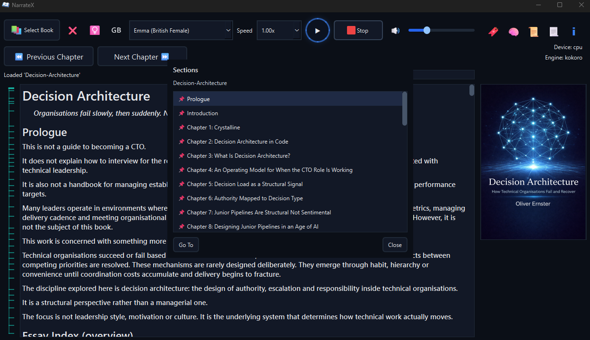

 [NarrateX](https://www.narratex.co.uk)

# NarrateX (Voice Reader app)

NarrateX is a desktop reading system that converts structured books into continuous audio playback.
It supports EPUB and PDF formats, preserves document structure and provides deterministic navigation through sections and chapters.
The system is designed to handle real-world book formats, including Kindle-compatible content and multi-book compilations.

NarrateX treats books as structured systems rather than raw text.

## Core behaviour

- Playback follows document structure rather than file order  
- Section navigation is derived from headings and bookmarks  
- Non-content is excluded from narration by structure rather than by guesswork: page numbers, running heads, contents entries and the back-of-book index are shown where they belong and never read aloud; PDF running heads and margin folios are stripped from the extracted text itself so they can never be indexed, narrated or displayed  
- Navigation loads immediately and processes in the background  
- Opening a book never freezes the window: parsing, structure and cover extraction run in a separate process while the interface stays responsive, with a live loading indicator  
- Voice choice is explicit: a sex toggle and a region toggle (British or American, Kokoro's full 28-voice English inventory) filter the dropdown, no voice is pre-selected and an amber prompt asks for a choice once a book loads  
- One consistent control language: a green ring on hover and keyboard focus, a red ring on any disabled control, everywhere including dialogs  
- Full keyboard reachability as one explicit focus ring: Tab and Right step forward, Shift+Tab and Left step back, the ring wraps and follows the visual order, Enter activates like Space, dropdowns open on Down and commit on Space or Tab and nothing is focused on launch  
- Remove current book (the ❌ beside Select Book) forgets bookmarks, resume position, ideas map, cached audio and the auto-load preference after a confirmation; the book file on disk is never touched  
- Progress names the chapter being read and Previous and Next step by chapters  
- Playback position is deterministic and consistent across sessions  
- Separator-only divider lines in source texts (e.g. `---`) are treated as non-content and ignored during playback  
- Click-to-seek: clicking in the reader restarts narration from the nearest chunk boundary (chunk-relative seeking)  

## Architecture

  

NarrateX uses a clean, four-layer architecture with every dependency pointing inward to a pure Domain that has no I/O and no framework. Layer boundaries are enforced by AST structural tests at every test run. See [ARCHITECTURE.md](ARCHITECTURE.md) for the full design.

# Screenshot

  

## Supported book formats

Native:

- EPUB (`.epub`)
- PDF (`.pdf`)
- Plain text (`.txt`)
- Markdown (`.md`, `.markdown`)

Kindle formats (via optional Calibre conversion to EPUB):

- MOBI (`.mobi`)
- AZW (`.azw`)
- AZW3 (`.azw3`)
- PRC (`.prc`)
- KFX (`.kfx`)

For a codebase overview (layers, runtime flow and test mapping), see [`ARCHITECTURE.md`](ARCHITECTURE.md:1).

## Building & development

Developer setup, running from source, tests and packaging/build instructions
(Windows, Linux, macOS) live in [DEVELOPMENT-README.md](DEVELOPMENT-README.md).
