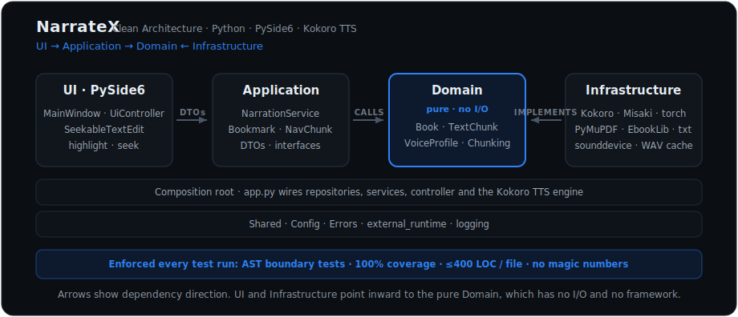
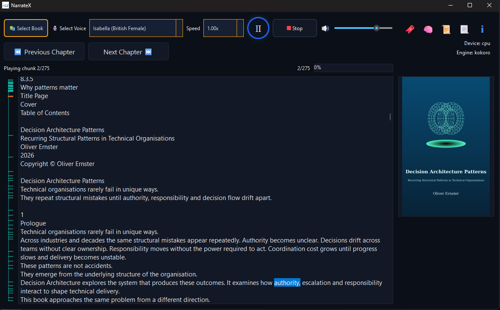

 [NarrateX](https://www.narratex.co.uk)

# NarrateX (Voice Reader app)

NarrateX is a desktop reading system that converts structured books into continuous audio playback.
It supports EPUB and PDF formats, preserves document structure, and provides deterministic navigation through sections and chapters.
The system is designed to handle real-world book formats, including Kindle-compatible content and multi-book compilations.

NarrateX treats books as structured systems rather than raw text.

## Core behaviour

- Playback follows document structure rather than file order  
- Section navigation is derived from headings and bookmarks  
- Non-content is excluded from narration by structure rather than by guesswork: page numbers, running heads, contents entries and the back-of-book index are shown where they belong and never read aloud  
- Navigation loads immediately and processes in the background  
- Opening a book never freezes the window: parsing, structure and cover extraction run in a separate process while the interface stays responsive, with a live loading indicator  
- Voice choice is explicit: a sex toggle and a region toggle (British or American, Kokoro's full 28-voice English inventory) filter the dropdown, no voice is pre-selected and an amber prompt asks for a choice once a book loads  
- One consistent control language: a green ring on hover and keyboard focus, a red ring on any disabled control, everywhere including dialogs  
- Playback position is deterministic and consistent across sessions  
- Separator-only divider lines in source texts (e.g. `---`) are treated as non-content and ignored during playback  
- Click-to-seek: clicking in the reader restarts narration from the nearest chunk boundary (chunk-relative seeking)  

## Architecture

<p align="center">
  
</p>

NarrateX uses a clean, four-layer architecture with every dependency pointing inward to a pure Domain that has no I/O and no framework. Layer boundaries are enforced by AST structural tests at every test run. See [ARCHITECTURE.md](ARCHITECTURE.md) for the full design.

# Screenshot

  

## Supported book formats

Native:

- EPUB (`.epub`)
- PDF (`.pdf`)
- Plain text (`.txt`)
- Markdown (`.md`, `.markdown`)

Kindle formats (via optional Calibre conversion to EPUB):

- MOBI (`.mobi`)
- AZW (`.azw`)
- AZW3 (`.azw3`)
- PRC (`.prc`)
- KFX (`.kfx`)

For a codebase overview (layers, runtime flow, and test mapping), see [`ARCHITECTURE.md`](ARCHITECTURE.md:1).

## Requirements

- Python 3.10, 3.11, or 3.12 (`kokoro` requires `Python<3.13`)
- spaCy `en_core_web_sm` model - installed automatically via `requirements.txt` using the PEP 440 URL format (no separate download step needed)

Optional:

- Calibre (for converting Kindle formats using `ebook-convert`)

**Linux:** system libraries (PortAudio, etc.) must be installed before the Python setup.
See [LINUX-INSTALLATION.md](LINUX-INSTALLATION.md) for distro-specific instructions.

## Install

```powershell
python -m venv .venv
.venv\Scripts\Activate.ps1
python -m pip install -r requirements.txt
```

## Run

```powershell
python app.py
```

### Startup behaviour

- Splash screen: enabled by default. Disable with `NARRATEX_DISABLE_SPLASH=1`.
- Single-instance: enabled by default. To allow multiple instances (dev/testing),
  set `NARRATEX_ALLOW_MULTIINSTANCE=1`.
- Window position: the main window is centered on the primary screen automatically at launch.

## Tests / Coverage

This repo enforces **100% test coverage** for the configured runtime scope.

- Canonical command: `pytest`
- Coverage config: [`.coveragerc`](.coveragerc:1) and [`pyproject.toml`](pyproject.toml:1)

Fast local iteration without coverage:

- `pytest --no-cov`

## Windows EXE builds

This repository uses **PyInstaller** for Windows EXE builds.

### Notes (Kokoro-only)

The app has been refactored to be **Kokoro-only**:

- No system fallback voice
- No XTTS/Coqui voice cloning

This significantly reduces dependency creep and makes packaging more predictable.

### Build the app EXE (PowerShell)

```powershell
 .venv\Scripts\Activate.ps1
python -m pip install -r requirements.txt
python buildexe.py
```

Output:

- `dist-pyinstaller/NarrateX/NarrateX.exe`

This uses a **onedir** build (recommended). The output folder will also contain
`_internal/` with the PyInstaller runtime and bundled dependencies.

## Windows installer builds

The installer is a separate **onefile** PyInstaller build that embeds a payload
zip of the app bundle.

Build workflow:

1) Build the app bundle (EXE + `_internal/`): [`buildexe.py`](buildexe.py:1)
2) Build the installer (`NarrateXSetup.exe`): [`buildinstaller.py`](buildinstaller.py:1)

### Build installer (PowerShell)

```powershell
.venv\Scripts\Activate.ps1
python -m pip install -r requirements.txt

# 1) Build dist-pyinstaller/NarrateX/NarrateX.exe (onedir)
python buildexe.py

# 2) Package payload + build dist-installer/NarrateXSetup.exe (onefile)
python buildinstaller.py
```

Output:

- `dist-installer/NarrateXSetup.exe`

### Troubleshooting

- If the EXE opens then immediately exits, check the crash logs written by [`app.main()`](app.py:55) near the executable.

#### Windows taskbar icon shows the Python icon

If Windows shows the Python icon for the *running* taskbar button (even though the
Explorer/Start Menu icon is correct), it usually means the shell is not grouping
the running process with the packaged EXE identity.

NarrateX enforces a stable identity early in startup by setting:

- Windows AppUserModelID: [`APP_APPUSERMODELID`](voice_reader/version.py:17)
- Qt desktop identity: `QApplication.setDesktopFileName(APP_APPUSERMODELID)` in [`app.main()`](app.py:52)

After rebuilding the EXE once, you may need to refresh the Windows icon cache:

```powershell
ie4uinit.exe -ClearIconCache
taskkill /IM explorer.exe /F
start explorer.exe
```

## Linux builds

Two build paths are provided for Linux:

- Flatpak (sandboxed, self-contained): build and install with
  [`build_flatpak.sh`](build_flatpak.sh). The Flatpak bundles the audio backend,
  the espeak-ng phonemizer, and the spaCy model, so no system dependencies are
  required at run time.
- Native onedir bundle (PyInstaller): build with [`buildlinux.py`](buildlinux.py:1),
  producing `dist-pyinstaller/NarrateX/`.

Running from source on Linux is covered in
[LINUX-INSTALLATION.md](LINUX-INSTALLATION.md).

## Tests

```powershell
.venv\Scripts\python.exe -m pytest
```

