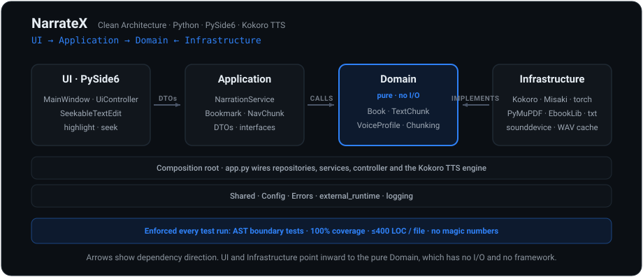
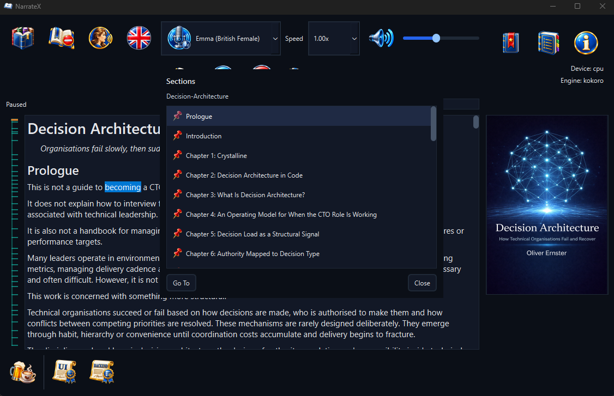

 [NarrateX](https://www.narratex.co.uk)

# NarrateX (Voice Reader app)

NarrateX is a desktop reading system that converts structured books into continuous audio playback.
It reads EPUB, PDF, plain text and Markdown, preserves document structure and provides deterministic
navigation through sections and chapters. It handles real-world book formats, including
Kindle-compatible content and multi-book compilations.

NarrateX treats books as structured systems rather than raw text. Everything runs on your machine:
the neural voice, the parsing and the audio cache. Nothing you read leaves the device.

> **Commercial licences available.** NarrateX is free and open source under GPL-3.0, with its interface
> layer under LGPL-3.0. If those terms do not suit what you are building, such as a closed-source
> product, a commercial licence can be bought from me separately. It covers my own code; PySide6 keeps
> its own LGPL-3.0 licence. See [commercial licensing](https://ernster.dev/commercial-licensing.html).

## Who it is for

- Readers with a large ebook library and little time to sit and read it
- Anyone who wants to listen to a book while doing something else, on a wired or wireless headset
- People who need a document read aloud predictably, with the frontmatter, page numbers and
  back-of-book index left out
- Developers who want a worked clean-architecture PySide6 application with the boundaries enforced
  by tests rather than by convention

## Who it is not for

- Mobile users. NarrateX is a desktop application: Windows, macOS and Linux. There is no phone or
  tablet build and none is planned.
- Anyone wanting cloud voices, an account or a subscription. There are none and there is no
  network call in the reading path.
- Anyone wanting voice cloning or a custom voice. NarrateX is Kokoro-only and ships Kokoro's
  English inventory as it stands.
- DRM-locked books. NarrateX reads files you can already open; it does not strip protection.
- Non-English narration. The shipped voice inventory is English (British and American) only.

## Capabilities

- Playback follows document structure rather than file order
- Section navigation is derived from headings and bookmarks
- Non-content is excluded from narration by structure rather than by guesswork: page numbers,
  running heads, contents entries and the back-of-book index are shown where they belong and never
  read aloud; PDF running heads and margin folios are stripped from the extracted text itself so
  they can never be indexed, narrated or displayed
- Navigation loads immediately and processes in the background
- Opening a book never freezes the window: parsing, structure and cover extraction run in a
  separate process while the interface stays responsive, with a live loading indicator
- Voice choice is explicit: a sex toggle and a region toggle (British or American, Kokoro's full
  28-voice English inventory) filter the dropdown, no voice is pre-selected and an amber prompt
  asks for a choice once a book loads
- One consistent control language: a green ring on hover and keyboard focus, a red ring on any
  disabled control, everywhere including dialogs
- Full keyboard reachability as one explicit focus ring: Tab and Right step forward, Shift+Tab and
  Left step back, the ring wraps and follows the visual order, Enter activates like Space,
  dropdowns open on Down and commit on Space or Tab and nothing is focused on launch
- Panes are never rung: a text view reached by Tab takes the arrow keys without an outline, a click
  never focuses it and every dialog opens on its first control rather than on its text
- A Help menu holding a Guide (every control, led by the picture it wears, plus the keyboard keys)
  and About
- The Guide and the licence texts read themselves slowly once open for a few seconds; scrolling,
  clicking or a key pauses them and they carry on from where you left them. The book in the reading
  pane never does this: it keeps pace with the narration
- The speaker button mutes and brings back the level you had
- Remove current book (the button beside Select book) forgets bookmarks, resume position, ideas map,
  cached audio and the auto-load preference after a confirmation; the book file on disk is never
  touched
- Progress names the chapter being read and Previous and Next step by chapters
- Playback position is deterministic and consistent across sessions
- Separator-only divider lines in source texts (e.g. `---`) are treated as non-content and ignored
  during playback
- Click-to-seek: clicking in the reader restarts narration from the nearest chunk boundary
  (chunk-relative seeking)
- Update notification: shortly after launch, then once a day while running, NarrateX asks GitHub's
  public releases API whether a newer version has been published (only a formally published release
  can prompt; the request carries nothing about you or your books). A newer release offers the
  download for your platform, with Skip This Version remembered and Later; the About dialog's
  Check for updates button runs the same check on demand and also reports up to date or unreachable

## Supported book formats

Native:

- EPUB (`.epub`)
- PDF (`.pdf`)
- Plain text (`.txt`)
- Markdown (`.md`, `.markdown`)

Kindle formats (via optional Calibre conversion to EPUB):

- MOBI (`.mobi`)
- AZW (`.azw`)
- AZW3 (`.azw3`)
- PRC (`.prc`)
- KFX (`.kfx`)

## Stack

| Concern | Choice |
| --- | --- |
| Language | Python 3.10 to 3.12 (the macOS dependency set pins 3.13) |
| User interface | PySide6 widgets, with a controller bridging UI events to application services |
| Speech synthesis | Kokoro, running on-device, with an espeak-ng phonemizer for out-of-dictionary words |
| Audio output | `sounddevice` over PortAudio, with an `afplay` path on macOS |
| Book parsing | ebooklib (EPUB), PyMuPDF (PDF) and an in-house pure-domain document model |
| Kindle conversion | Calibre `ebook-convert`, optional |
| Persistence | JSON bookmark, preference and ideas stores plus a filesystem audio cache |
| Tests | pytest with a 100% coverage gate over the configured runtime scope |
| Format and lint | black (88), flake8, ruff |
| Packaging | PyInstaller (Windows onedir plus installer, Linux onedir, macOS DMG) and Flatpak |
| Licence | GPL-3.0, with the reusable UI layer under LGPL-3.0 |

## Architecture

<p align="center">
  
</p>

NarrateX uses a clean, four-layer architecture with every dependency pointing inward to a pure
Domain that has no I/O and no framework. Layer boundaries, the composition-root whitelist, the
400-line module limit with its danger band and the derivation of every icon from one master are
enforced by structural tests at every test run. See
[ARCHITECTURE.md](ARCHITECTURE.md) for the invariants and the full design;
[ARCHITECTURE_CONSTRAINTS.md](ARCHITECTURE_CONSTRAINTS.md) holds the constraints themselves.

## Screenshot



## Install and run

Full developer setup, including the per-platform dependency sets, is in
[DEVELOPMENT-README.md](DEVELOPMENT-README.md). The short version on Windows:

```powershell
python -m venv venv
venv\Scripts\Activate.ps1
python -m pip install -r requirements.txt
python app.py
```

Linux needs its system audio libraries first; see [LINUX-INSTALLATION.md](LINUX-INSTALLATION.md).
macOS uses `requirements-mac.txt` and a Python 3.13 virtual environment.

On first run NarrateX downloads the Kokoro model weights (around 300 MB) from HuggingFace Hub.
After that the reading path is entirely offline; the one recurring network request is a daily
check of this project's GitHub releases for a newer version, which carries nothing about you or
your books and fails silently without a connection.

## Tests

```powershell
venv\Scripts\python.exe -m pytest -q
```

The suite runs under a strict 100% coverage gate, so the coverage table prints last and there is no
"N passed" line. Read the exit code: `0` means every test passed and the gate was met. Testing
conventions and the structural suite are documented in [TESTING.md](TESTING.md).

## Build

```powershell
python buildexe.py
python buildinstaller.py
```

That produces `dist-pyinstaller/NarrateX/NarrateX.exe` and then
`dist-installer/NarrateXSetup.exe`. Linux builds with `build_flatpak.sh` (Flatpak) or
`buildlinux.py` (onedir bundle); macOS builds with `builddmg.py`.

Every packager reads the version from the repo-root `VERSION` file and ships that file beside the
application, so a built copy reports the same number as the source tree. The two Windows packagers
also run `stamp_version.py` before packaging, so a release cannot ship site pages that disagree with
`VERSION`.

Icons are generated rather than authored. `generate_icons.py` derives every size, the Windows
`narratex.ico` and the site's copies under `docs/` from the single master `narratex.png`, then reduces
each button picture in `assets/` to the copy the application ships under `voice_reader/ui/artwork/`;
`python generate_icons.py --check` compares the tracked set against a fresh render without writing
anything, which is the same comparison the structural suite makes.

## Supporting the project

NarrateX is free and stays free. There is no paid tier, no licence key and no feature held back behind
a donation. If it has replaced something you were paying for, a donation supports its maintenance and
continued development. The same link sits at the foot of the application's own window, where the
donate button hands it to your browser; NarrateX itself never opens a connection for it.

<a href="https://www.paypal.com/ncp/payment/26YQ4HUNDHYXY"></a>

## Licence

NarrateX is free software. The application is released under the GNU General Public License v3.0
([LICENSE](LICENSE)) and the reusable Qt user-interface layer under the GNU Lesser General Public
License v3.0 ([LGPL3-LICENSE](LGPL3-LICENSE)), aligning with Qt's own licensing.

A commercial licence for my own code is also available, separately from the open-source licences: see
[commercial licensing](https://ernster.dev/commercial-licensing.html).

For the standing reference to what is still open, what is deliberately left and what only looks
like debt, see [TECH_DEBT.md](TECH_DEBT.md).
