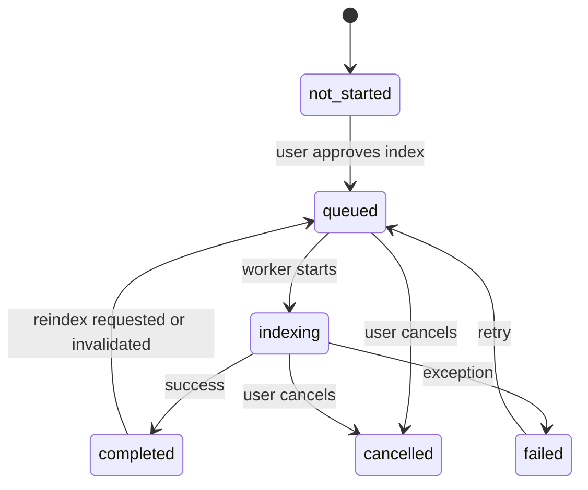

# NarrateX Ideas (🧠) — Background execution & performance isolation (Phase 5)

Hard requirement: playback reliability first.

Approved concurrency preference: **separate process** for indexing for maximum isolation on Windows.

Repo context:

- Playback already runs in a background thread via [`NarrationService.start()`](voice_reader/application/services/narration_service.py:156).
- UI state updates are marshalled onto Qt thread via [`UiController.state_received`](voice_reader/ui/ui_controller.py:48) and applied in [`apply_state()`](voice_reader/ui/_ui_controller_state.py:19).

---

## 1) Recommended concurrency model

### Model

- Use a **single-worker background process** dedicated to Ideas indexing.
- The UI/app submits jobs via an `IndexingManager`.
- Communication from worker → UI via:
  - a `multiprocessing.Queue` (progress events + completion)
  - or `multiprocessing.connection` pipe

Rationale:

- spaCy and NLP tokenization can be CPU-heavy; a process provides:
  - separation from playback threads
  - an independent memory space (less risk of fragmentation/pressure impacting playback)
  - clean kill/cancel semantics

Windows notes:

- Use `spawn` start method implicitly (Windows default). Keep worker entrypoints import-safe.
- Avoid passing large Python objects repeatedly; pass text once per job.

---

## 2) Indexing state machine

Index status states (persisted + runtime view):

- `not_started`
- `queued`
- `indexing`
- `completed`
- `failed`
- `cancelled`

State transitions:

Rules:

- `completed` is the only state that should unlock “open Ideas dialog immediately”.
- `failed` must never block playback; it only affects Ideas UX.

---

## 3) Progress-reporting design (0–100%)

Progress should be **stage-weighted** so it feels linear and stable.

Event shape (from worker):

- `job_started(book_id)`
- `progress(book_id, percent, stage, message)`
- `job_completed(book_id, output_path)`
- `job_failed(book_id, error_message)`

Stage weighting example (v1):

- 0–10%: sectioning + setup
- 10–25%: sentence segmentation
- 25–80%: concept extraction + scoring (largest)
- 80–95%: anchor resolution + hierarchy assembly
- 95–100%: write output atomically

UI:

- Show numeric percent 0–100.
- Keep messages calm (no marketing language).

---

## 4) Cancellation and failure handling

### Cancellation

- UI issues `cancel(job_id)`.
- Manager signals worker (shared `Event` or control pipe).
- Worker cooperatively checks cancellation between stages and during long loops.

If cooperative cancel fails (worker hung):

- Manager may terminate the process.
- On next startup, any partial temp files are ignored/cleaned.

### Failure

- Worker catches exceptions and emits `job_failed` with a concise message.
- UI shows an error with a Retry button.
- No crash propagation into playback.

---

## 5) Persistence strategy during background work

Target file:

- `bookmarks/<book_id>.ideas.json`

Temp file strategy:

- write to `bookmarks/<book_id>.ideas.json.tmp`
- atomic replace on success

Optional crash recovery marker:

- `bookmarks/<book_id>.ideas.json.lock` or embed `status.state=indexing` in a separate small status file.

Conservative v1 recommendation:

- Do **not** persist partial idea maps.
- Only write final output at completion.

Rationale:

- avoids complex merge/migration logic
- ensures “completed index” implies validity

---

## 6) Guardrails to prevent playback performance regression

Process isolation already does most of the work. Additional guardrails:

- **Single indexing job at a time**.
- On playback start, optionally reduce worker priority:
  - Windows: set process priority class lower (if we choose to implement; can be deferred).
- In the worker:
  - enforce max text processed for NLP stages
  - use stage-level yields (progress events) to avoid long uninterruptible loops

Book switching:

- If the user switches books mid-index:
  - default: cancel the current job (or keep running in background, but detach UI)
  - v1 safest: cancel to avoid surprise CPU use and to keep state simple

App close mid-index:

- On close:
  - manager requests cancel
  - if worker doesn’t exit quickly, terminate
  - temp output is discarded

